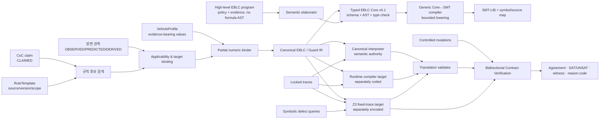

# EBLC-P0b: CoCㆍ제약사항에서 SMT 검증 결과까지

## 1. 보고서 목적

이 보고서는 `EBLC-P0B-001`의 공개 synthetic 보행자 conflict-zone 예를
사용해 다음 연결을 설명한다.

```text
CoC 단서 + 관측 장면 + 규칙 + 차량 profile + 근거
  → schema-driven EBLC 계약
  → canonical/runtime/Z3 target
  → SAT/UNSATㆍ반례ㆍtranslation agreementㆍBCV mutation 결과
```

현재 구현이 검증하는 것은 제한된 EBLC 계약의 구조, lifecycle, 수치 조건,
입력 실패 처리 및 target 간 의미 일치다. 실제 교통법의 정확성, 센서 성능,
실차 제동 보장 또는 차량 안전성을 검증하는 보고서가 아니다.

최신 실행 범위는 다음과 같다.

- 실험 ID: `EBLC-P0B-001`
- P0b run: `p0b-fail-closed-2026-08-08-v1`
- robustness run: `robustness-fail-closed-2026-08-08-v6`
- Core→SMT run: `core-smt-2026-08-08-v4`
- high-level elaboration/conformance run: `elaboration-conformance-2026-08-08-v3`
- solver: 프로젝트 로컬 Z3 5.0.0
- claim scope: `P0B_SCHEMA_AND_BOUNDED_EXECUTION_NOT_VEHICLE_SAFETY`

## 2. 선행연구와 EBLC 설계의 경계

EBLC의 개별 재료는 선행연구에 기반한다. 현재 연구의 방법 기여 후보는 각
재료의 최초 발명이 아니라, open-world 장면에서 이를 근거ㆍbindingㆍ수치ㆍ
lifecycle을 보존하는 하나의 계약과 양방향 검증 workflow로 통합하는 데 있다.

| EBLC 요소 | 선행 기반 | EBLC-P0b에서 추가한 경계 |
|---|---|---|
| 규칙 검색 | DriveReg 계열 regulation RAG | 검색 후보를 typed rule/source/scope로 제한 |
| 위험 활성 | RTCD4ADS 계열 scene-aware activation | `TRUE/FALSE/UNKNOWN/CONFLICT`와 active ledger로 확장 |
| 정지 위치 | 교통규칙 구체화, 지도ㆍscene grounding | target/zone과 source-bearing margin의 partial binding |
| 허용 속도 | 고전 제동거리, RSSㆍCBFㆍreachability 계열 | 차량 profile과 uncertainty를 derivation DAG로 보존 |
| 유지ㆍ해제ㆍ재활성 | temporal logic, timed automata, receding-horizon monitoring | one-frame dropout, stale obligation, reappearance를 EBLC 상태로 구분 |
| UNKNOWN fallback | open-world reasoning, uncertainty-aware planning, selective abstention | 승인된 fallback만 실행하고 나머지는 review/unsupported 처리 |
| 근거ㆍ수치 유도 | provenance KG, evidence retrieval, assurance case | source ref와 parameter dependency를 실행 계약에 포함 |
| 행동 필터 | SanDRA 계열 temporal-rule/reachability filtering | EBLC를 downstream monitor/planner가 소비하는 검증된 interface로 제공 |
| 양방향 검증 | SMT/BMC, contract verification, mutation analysis | underconstraint와 overconstraint, lifecycle 및 compiler translation을 함께 검사 |

상세한 선행연구 매핑은 [상황 인지형 가드 합성 전략 문서](../surveys/guard-synth-coc/CONTEXT_AWARE_GUARD_SYNTHESIS_SURVEY_AND_STRATEGY_V1.md)와
[연구계획](../plans/guard-synth-coc/RESEARCH_PLAN_V1.md)을 따른다.

현재 fixture의 `1.5 m`, `2 frame`, `3.0 m/s²`, `0.5 s` 같은 값은 실제
법규나 실차 인증값이 아니다. 모두 synthetic system requirement 또는 synthetic
vehicle profile이며 이 값 자체를 선행연구의 검증된 안전값으로 주장하지 않는다.

## 3. 변환ㆍ검증 아키텍처



역할은 다음과 같이 분리한다.

1. JSON Schema는 문법과 필수 필드를 검사한다. operational semantics의 근거가 아니다.
2. Python type은 immutable representation이다. 전이 의미를 결정하지 않는다.
3. canonical interpreter가 EBLC operational semantics의 기준이다.
4. runtime target은 canonical 함수를 import하지 않고 같은 의미를 별도 코드로 구현한다.
5. P0b Z3 target은 고정 trace와 네 symbolic query를 별도 제약식으로 인코딩한다.
6. 새 generic compiler는 typed EBLC Core를 읽어 특정 보행자 구현을 import하지 않고
   time-indexed Z3 식과 SMT-LIB를 생성한다.
7. translation validator는 각 target의 `accepted`, `verdict`, lifecycle sequence,
   violation set을 정규화해 비교한다.
8. BCV는 정상 계약뿐 아니라 의도적으로 망가뜨린 under/overconstraint 계약의
   witness가 검출되는지 확인한다.

세 target이 같은 결과를 냈다는 사실은 translation evidence다. 동일 fixture와
controlled oracle을 사용하므로 독립 차량 안전 oracle이라고 부르지 않는다.

## 4. 구체적인 공개 synthetic 입력 예

### 4.1 CoC 단서

다음은 공개 P0b fixture를 사람이 읽을 수 있게 표현한 synthetic CoC 예다.

```text
원인: 보행자 P17이 ego 경로의 conflict zone CZ4와 충돌할 가능성이 있다.
행동: ego는 보행자에게 양보하고 conflict가 해소될 때까지 zone 진입 전에 유지한다.
재평가: conflict가 해소된 뒤 다시 나타나면 양보 의무를 재활성화한다.
```

이 문장은 설명을 위한 concrete synthetic 예이며 실제 NVIDIA CoC 원문이나 현재
runner의 자연어 parser 출력이 아니다. 시스템 안에서는 `CLAIMED` 단서로만 취급한다.
CoC만 있고 관측 fact가 없으면 계약을 `VALIDATED`하지 않고 `REVIEW_REQUIRED`로
보낸다.

### 4.2 관측 ContextFrame

초기 공개 fixture는 다음과 같다.

```json
{
  "timestamp_s": 0.0,
  "hazard_fact": {
    "truth": "TRUE",
    "epistemic_kind": "OBSERVED",
    "source": "SYNTHETIC-P0B-SENSOR",
    "timestamp_s": 0.0,
    "maximum_age_s": 0.2
  },
  "ego_front_x_m": -12.0,
  "ego_speed_mps": 6.0,
  "zone_entry_x_m": 0.0,
  "target_entity_id": "synthetic-pedestrian:P17",
  "zone_id": "synthetic-zone:CZ4",
  "coordinate_frame": "ego_path_s",
  "distance_unit": "m"
}
```

CoC claim과 달리 이 hazard fact는 synthetic fixture에서 `OBSERVED`로 명시돼 있다.
실제 센서 정확성을 뜻하지는 않는다.

### 4.3 RuleTemplate과 차량 profile

공개 rule은 실제 법규가 아니라 다음 ID의 synthetic system requirement다.

```text
rule_id                  = P0B-SYS-PED-CZ-001
source_class             = SYSTEM_REQUIREMENT
precondition             = pedestrian_conflict == TRUE
stop_margin              = 1.5 m
release                  = fresh FALSE 2회 연속
reactivation             = RELEASED 이후 fresh TRUE
fallback                 = fresh UNKNOWN에서 이전 live obligation 유지
fallback_approved        = true
```

차량 profile도 synthetic이다.

```text
maximum_service_deceleration = 3.0 m/s²
response_time                = 0.5 s
position_uncertainty         = 0.5 m
```

값이나 evidence reference가 없으면 binder는 임의 default를 만들지 않고
`UNSUPPORTED`를 반환한다.

### 4.4 Binder가 만든 EBLC 계약

정지 위치는 다음과 같이 유도한다.

```text
stop_position
  = zone_entry_x - sourced_stop_margin
  = 0.0 - 1.5
  = -1.5 m
```

초기 frame에서 정지에 사용할 수 있는 거리는 다음과 같다.

```text
available_distance
  = stop_position - ego_front_x - position_uncertainty
  = -1.5 - (-12.0) - 0.5
  = 10.0 m
```

응답 지연을 포함한 최대 속도는 제동거리 식을 풀어 계산한다.

```text
d >= v*rho + v²/(2b)

v_max = -b*rho + sqrt((b*rho)² + 2bd)
      = -3.0*0.5 + sqrt((3.0*0.5)² + 2*3.0*10.0)
      ≈ 6.39 m/s
```

초기 synthetic 속도 `6.0 m/s`는 이 계산 경계 아래다. 이 계산은 fixture 내부
일관성을 보여줄 뿐 실제 차량이 `3.0 m/s²` 감속을 보장한다는 뜻은 아니다.

결합된 핵심 계약은 다음과 같다.

```text
target       = synthetic-pedestrian:P17
zone         = synthetic-zone:CZ4
activation   = fresh observed hazard TRUE
invariant    = live 상태에서 ego_front_x <= -1.5 m
speed bound  = live 상태에서 stopping_distance <= available_distance
release      = fresh FALSE 2회 연속
reactivation = RELEASED 이후 fresh TRUE
fallback     = live + fresh UNKNOWN이면 approved hold
expiry       = scope invalid 또는 명시된 expiry 도달
```

실제 JSON fixture는 [RuleTemplate](../../src/guard_synth_eblc/fixtures/rule_template.json),
[ContextFrame](../../src/guard_synth_eblc/fixtures/context_frame.json),
[EBLC contract](../../src/guard_synth_eblc/fixtures/eblc_contract.json)에 있다.

### 4.5 EBLC 명세 내용을 읽는 방법

EBLC 명세는 단순히 “차량을 정지시켜라”라는 한 문장이 아니다. 다음 질문에
각각 답하는 실행 계약이다.

| 명세 부분 | 답하는 질문 | 이 예의 내용 | 실행 효과 |
|---|---|---|---|
| `source/scope` | 이 규칙은 어디에서 왔고 어디에 적용되는가? | synthetic system requirement, 1D pedestrian conflict zone | 실제 법규로 오인하지 않고 scope 밖이면 만료 |
| `precondition` | 언제 의무가 시작되는가? | fresh observed `pedestrian_conflict=TRUE` | `INACTIVE→ACTIVE` |
| `subject/target/zone` | 누가 누구와 어느 공간에 대해 의무를 갖는가? | ego, P17, CZ4 | 다른 객체나 zone에는 같은 계약을 자동 적용하지 않음 |
| `invariant` | 의무가 활성화된 동안 절대 깨지면 안 되는 것은 무엇인가? | ego front가 `-1.5 m`를 넘지 않음 | 초과 trace에 entry violation 생성 |
| `bound` | 계속 만족해야 하는 수치 경계는 무엇인가? | 정지 가능 거리로부터 계산한 동적 속도 상한 | 상한 초과 trace에 speed violation 생성 |
| `maintenance` | 위험이 계속되거나 잠깐 불확실할 때 무엇을 하는가? | TRUE이면 유지, approved UNKNOWN이면 이전 의무 유지 | 한 frame의 흔들림으로 의무를 삭제하지 않음 |
| `release` | 언제 의무가 끝났다고 판단하는가? | fresh FALSE 2회 연속 | 첫 FALSE는 유지, 두 번째에서 `RELEASED` |
| `reactivation` | 해제 후 위험이 돌아오면 어떻게 하는가? | `RELEASED` 이후 fresh TRUE | `REACTIVATED`로 다시 의무 부과 |
| `expiry` | 더는 계약 자체가 유효하지 않은 때는 언제인가? | scope invalid 또는 expiry 도달 | 재활성 가능한 release와 달리 `EXPIRED`로 종료 |
| `fallback` | 관측 실패 시 어떤 보수 동작이 승인됐는가? | live obligation hold | 승인되지 않은 추정 대신 review/hold |
| `evidence_refs` | 규칙과 수치는 무엇으로 정당화되는가? | synthetic rule/profile ID | 출처 없는 수치를 hard constraint로 만들지 않음 |
| `derivation_dag` | 최종 수치가 어떻게 계산됐는가? | zone, margin, response, deceleration, uncertainty | 결과 재계산과 원인 추적 가능 |
| `priority` | 진행·편안함과 충돌하면 무엇을 우선하는가? | mandatory system이 route progress/service를 override | scalar weight로 조용히 안전 조건을 제거하지 않음 |

이 계약을 자연어로 순서대로 읽으면 다음과 같다.

> synthetic scope 안에서 관측된 보행자 P17과 zone CZ4의 conflict가 fresh TRUE이면
> ego의 양보 의무를 즉시 활성화한다. 의무가 활성화된 동안 ego front는 `-1.5 m`
> 이전에 있어야 하며, 현재 거리ㆍ응답시간ㆍ감속도ㆍ위치 불확실성으로 계산한
> 정지 가능 속도를 넘지 않아야 한다. fresh FALSE가 두 번 연속 확인되면 의무를
> 해제하지만, 이후 conflict가 다시 TRUE이면 재활성화한다. 입력이 오래됐거나
> CoC claim뿐이면 이를 관측 TRUE로 간주하지 않으며, 값ㆍ단위ㆍ좌표계ㆍ근거가
> 불완전하면 임의 보정하지 않고 review 또는 unsupported를 반환한다.

명세는 assumption과 obligation으로도 나눠 읽을 수 있다.

```text
Assumption / 입력 전제
  - target과 zone association이 명확하다.
  - 단위와 좌표계가 일치한다.
  - timestamp가 fresh하고 순서대로 증가한다.
  - vehicle profile 값과 evidence reference가 존재한다.

Obligation / 전제 아래 요구되는 것
  - hazard가 활성화되면 lifecycle 의무를 만든다.
  - live 동안 정지 위치와 동적 속도 bound를 지킨다.
  - 충분한 clear evidence 전에는 해제하지 않는다.
  - 위험이 재등장하면 재활성화한다.

Abstention / 전제가 충족되지 않을 때
  - UNKNOWN, REVIEW_REQUIRED, UNSUPPORTED 또는 CONFLICT를 반환한다.
  - 누락된 값을 synthetic default로 채우지 않는다.
```

따라서 `VALIDATED`는 “현실에서 안전하다”가 아니라, 명시된 synthetic 입력 전제와
bounded semantics 안에서 계약이 구성되고 판정될 수 있다는 의미다.

## 5. SMT 명세

P0b의 fixed-trace checker는 Python Z3 API로 제약을 만들며 구현은
[z3_bounded_checker.py](../../src/guard_synth_eblc/z3_bounded_checker.py)에 있다.
후속 generic compiler는 [EBLC Core schema](../../src/guard_synth_eblc/schemas/eblc_core_ir.schema.json)와
[typed AST/type checker](../../src/guard_synth_eblc/core_ir.py)를 거쳐
[Core→SMT compiler](../../src/guard_synth_eblc/smt_compiler.py)에서 재실행 가능한 `.smt2`를
출력한다. 아래 5.1~5.8은 P0b operational encoding을, 5.9는 generic 문법과 변환을
설명한다.

### 5.1 유한 상태와 진리값

```text
Lifecycle:
  INACTIVE=0, CANDIDATE=1, ACTIVE=2, MAINTAINED=3,
  RELEASED=4, REACTIVATED=5, EXPIRED=6

Truth:
  TRUE=0, FALSE=1, UNKNOWN=2, CONFLICT=3

Verdict:
  VALIDATED=0, REVIEW_REQUIRED=1, UNSUPPORTED=2, CONFLICT=3
```

시간 `t`마다 다음 변수를 만든다.

```text
state[t]        : Int
clear[t]        : Int
raw_truth[t]    : Int
effective[t]    : Int
timestamp[t]    : Real
fact_time[t]    : Real
ego_x[t]        : Real
ego_speed[t]    : Real
verdict[t]      : Int
```

초기 조건은 다음과 같다.

```smt2
(assert (= state_0 INACTIVE))
(assert (= clear_0 0))
```

### 5.2 Freshness와 epistemic 변환

```text
age_t = timestamp_t - fact_time_t
freshness_t = min(fact_max_age_t, predicate_maximum_age)

effective_t = UNKNOWN
  if age_t < -epsilon
  or age_t > freshness_t + epsilon
  or epistemic_kind_t = CLAIMED

effective_t = raw_truth_t otherwise
```

따라서 CoC의 `CLAIMED` 문장은 `TRUE` activation fact로 직접 사용되지 않는다.

### 5.3 Lifecycle 전이

핵심 전이는 다음과 같다.

```text
INACTIVE|CANDIDATE + TRUE     → ACTIVE
INACTIVE|CANDIDATE + FALSE    → INACTIVE
INACTIVE|CANDIDATE + UNKNOWN  → CANDIDATE

ACTIVE|MAINTAINED|REACTIVATED + TRUE
                               → MAINTAINED, clear=0

live + FALSE                  → clear=clear+1
live + FALSE + clear>=2       → RELEASED
live + UNKNOWN + approved     → MAINTAINED

RELEASED + TRUE + enabled     → REACTIVATED
CONFLICT                      → state/clear 유지, verdict=CONFLICT
scope invalid/expiry          → EXPIRED
```

단순화한 Z3 형태는 다음과 같다.

```smt2
(assert
  (= state_t1
     (ite (not supported_t)
          base_state_t
          (delta base_state_t clear_t effective_t))))
```

### 5.4 입력과 verdict

다음 입력은 lifecycle을 진행하지 않고 `UNSUPPORTED`로 종료한다.

```text
empty trace
non-finite JSON/profile/scene/contract number
negative timestamp/age/speed range
decreasing frame timestamp
unit mismatch
coordinate-frame mismatch
invalid braking/response/uncertainty contract
```

정상 입력에서 verdict 우선순위는 각 조건의 심각도에 따라
`UNSUPPORTED`, `CONFLICT`, `REVIEW_REQUIRED`, `VALIDATED`로 결정한다. Trace
집계에서는 conflict 존재를 보존하고 unsupported/review를 뒤따라 확인한다.

### 5.5 정지 위치 위반

```text
entry_violation_t =
  supported_t
  AND live(state_t1)
  AND target_ok_t
  AND invariant_enabled
  AND ego_x_t > stop_position + epsilon
```

### 5.6 동적 정지 속도 위반

```text
available_t = stop_position - ego_x_t - uncertainty
v'_t        = ego_speed_t - epsilon
stop_dist_t = v'_t * response_time + v'_t² / (2 * deceleration)

speed_violation_t =
  invariant_enabled
  AND live(state_t1)
  AND (
       available_t <= 0 AND ego_speed_t > epsilon
       OR
       available_t > 0 AND v'_t > 0 AND stop_dist_t > available_t
  )
```

위반 여부는 Z3 rational constraint로 판정한다. 사람이 읽는
`maximum_safe_speed_mps` 값은 solver model과 같은 입력을 사용해 결과 구성 단계에서
재계산한다.

### 5.7 네 symbolic query

| Query | 반례 조건 | 정상 계약 기대 |
|---|---|---|
| lifecycle consistency | horizon 4에서 허용 목록 밖 전이 존재 | `UNSAT` |
| active stop-position violation | hazard TRUE로 live가 된 뒤 `ego_x > stop_position` | `SAT`과 위치 witness |
| missing reactivation | `RELEASED + TRUE`인데 다음 상태가 `REACTIVATED`가 아님 | `UNSAT` |
| false deadlock | safe progress가 있는데 stop/progress 모두 불허 | `UNSAT` |

Lifecycle query는 horizon 4에서 `TRUE/FALSE/UNKNOWN`의 `3^4=81` 조합에 대응하는
symbolic space를 검사한다. `CONFLICT`, expiry, 다중 actor의 전체 조합을 보편적으로
증명하는 질의는 아니다.

### 5.8 SMT 명세를 자연어로 읽는 방법

SMT 명세는 계약 전체에 한 번 `SAT` 또는 `UNSAT` 도장을 찍는 것이 아니다. 먼저
“어떤 결함이 존재하는가?”라는 query를 만들고, 그 결함 조건을 만족하는 변수 배치가
있는지 Z3에 묻는다.

```text
정상 조건 + 찾고 싶은 결함 조건
  → 동시에 만족하는 실행이 있는가?
```

결과는 query의 문장에 따라 해석해야 한다.

| Query 문장 | `SAT`의 의미 | `UNSAT`의 의미 |
|---|---|---|
| 금지된 lifecycle 전이가 존재한다 | 금지 전이를 만드는 truth/state witness가 발견됨 | 현재 horizon에서는 금지 전이를 찾지 못함 |
| 활성 중 정지 위치를 넘는 실행이 존재한다 | 실제 위반 위치 witness가 발견됨 | 현재 수식에서는 그런 위치를 만들 수 없음 |
| release 후 TRUE인데 재활성화되지 않는 실행이 존재한다 | reactivation 누락 반례가 발견됨 | 현재 단일 전이에서는 누락 반례가 없음 |
| safe progress가 있는데 모든 행동이 막히는 실행이 존재한다 | 과잉제약 deadlock 반례가 발견됨 | 현재 query에서는 progress 또는 stop 중 하나가 가능 |

따라서 `SAT`가 항상 좋은 결과이거나 항상 나쁜 결과인 것은 아니다. 예를 들어
“위반 witness가 존재하는가?”라는 검사에서 `SAT`는 checker가 위반을 실제로 구성해
낼 수 있음을 보여준다. 반대로 “금지된 전이가 존재하는가?”에서 `SAT`는 계약이나
compiler에 결함 후보가 있다는 뜻이다.

현재 fixed-trace 검증과 symbolic query도 구분해야 한다.

```text
Fixed-trace encoding
  입력 frame 값을 Z3 변수와 같게 고정
  → 같은 trace의 lifecycle/verdict/violation을 solver model에서 복원
  → canonical/runtime 결과와 번역 일치 비교

Symbolic query
  truth, state 또는 위치 일부를 자유 변수로 둠
  → 결함 조건을 만족하는 반례가 존재하는지 탐색
```

즉, fixed-trace의 `SAT`는 보통 “주어진 trace 제약이 일관되게 실행 가능하다”는
뜻이고, symbolic defect query의 `SAT`는 “요청한 결함 witness가 존재한다”는 뜻이다.
이 둘을 구분하지 않으면 `SAT` 결과를 잘못 해석하게 된다.

### 5.9 공개 EBLC Core v0.1과 generic SMT 변환

기존 P0b checker의 Python 수식을 일반화하기 위해 다음 bounded discrete-time Core
문법을 추가했다.

| 문법 요소 | 의미 | SMT 변환 |
|---|---|---|
| `BOOL/INT/REAL/ENUM` declaration | 변수의 sort와 finite enum domain | `Bool/Int/Real`, enum은 범위가 제한된 `Int` |
| `time_varying` | 시간에 따라 변하는 변수인지 여부 | `name__t0 ... name__tH` 또는 단일 `name__const` |
| `unit/frame` | 수치의 물리 차원과 좌표계 | SMT 전에 type checker가 불일치를 거부 |
| `and/or/not/implies` | 논리 결합 | Z3 Boolean connective |
| `eq/ne/lt/le/gt/ge` | 동등ㆍ경계 조건 | sort/unit/frame 검사 후 Z3 비교식 |
| `add/sub/mul/div/neg` | 수치 유도식 | Z3 산술식, `div`는 분모 `!=0` 조건 추가 |
| `ite` | 조건별 lifecycle/state/value 선택 | Z3 `If` |
| `always[a,b] p` | 구간의 모든 frame에서 `p` | `AND(p[a],...,p[b])` |
| `eventually[a,b] p` | 구간 중 한 frame에서 `p` | `OR(p[a],...,p[b])` |
| `p until[a,b] q` | `q` witness 전까지 `p` 유지 | witness별 prefix conjunction의 disjunction |
| clause enforcement | 초기/모든 frame/모든 전이/trace | horizon에 맞춰 base time별 복제 |
| `DECLARATIVE` | 검사할 속성이지 모델 가정이 아님 | base assertion에서 제외하고 violation query로 사용 |

예를 들어 다음 Core 식은 “0~3 frame 중 활성화된 다음 상태에서 정지 위치를 넘는
경우가 존재하는가?”를 뜻한다.

```json
{
  "op": "eventually", "start": 0, "end": 3,
  "arg": {
    "op": "and", "args": [
      {"op": "var", "name": "stop_allowed", "offset": 1},
      {"op": "gt",
       "left": {"op": "var", "name": "ego_front_x", "offset": 0},
       "right": {"op": "var", "name": "stop_position", "offset": 0}}
    ]
  }
}
```

컴파일 결과는 개념적으로 다음처럼 펼쳐진다.

```smt2
(assert
  (or (and stop_allowed__t1 (> ego_front_x__t0 stop_position__const))
      (and stop_allowed__t2 (> ego_front_x__t1 stop_position__const))
      (and stop_allowed__t3 (> ego_front_x__t2 stop_position__const))
      (and stop_allowed__t4 (> ego_front_x__t3 stop_position__const))))
(check-sat)
```

스키마가 syntax를, typed AST가 representation을, type checker가 unit/frame/time
well-formedness를 담당하고, `smt_compiler.py`가 operational lowering을 담당한다.
출력에는 공통 `MODEL.smt2`, query별 `QUERY_*.smt2`, `SYMBOL_TABLE.json`,
`SOURCE_MAP.json`, `QUERY_MANIFEST.json`이 포함된다.

Core v0.1에서 “완성”의 범위는 위 bounded 문법과 변환이다. 무한시간 temporal
logic, 연속ㆍhybrid dynamics, quantifier, 다중 계약 합성, freshness/verdict의 모든
P0b 경로를 Core로 옮긴 완전한 언어는 아직 아니다.

### 5.10 고수준 EBLC program과 semantic elaborator

Core 수식을 사람이 직접 작성해야 했던 한계를 줄이기 위해
[고수준 program schema](../../src/guard_synth_eblc/schemas/eblc_program.schema.json),
[program validator](../../src/guard_synth_eblc/program.py),
[semantic elaborator](../../src/guard_synth_eblc/elaborator.py)와
[conformance harness](../../src/guard_synth_eblc/conformance.py)를 추가했다.

고수준 fixture에는 Core의 `formula`, `ite`, 상태 전이식이 없다. 대신 다음 정책과
각 항목의 evidence reference가 들어간다.

```text
binding       = subject, target, zone, unit, coordinate frame
predicate     = allowed epistemic kinds, maximum age, failure-to-UNKNOWN
lifecycle     = release frame 수, reactivation, expiry, UNKNOWN fallback
constraints   = stop position, uncertainty, response, deceleration, typed epsilon
derivation    = 수치 유도 node와 source
priority      = class와 override 관계
```

Elaborator가 여기서 다음 Core clause를 자동 생성한다.

```text
effective_truth = freshness + epistemic failure 처리
state[t+1]      = activation/maintenance/release/reactivation/expiry/fallback
clear[t+1]      = consecutive-clear counter
verdict[t]      = UNSUPPORTED/CONFLICT/REVIEW_REQUIRED/VALIDATED precedence
entry_violation[t]
speed_violation[t]
deadlock_violation[t]
progress_allowed[t]
```

따라서 이번 단계 이후에는 P0b lifecycle의 긴 `ite` 전이식을 사용자가 직접 작성하지
않아도 된다. 다만 현재 elaborator는 단일 bound contract용이며 priority는 scalar로
변환하지 않고 provenance로 보존할 뿐, 여러 계약의 충돌을 아직 해결하지 않는다.

## 6. 구체적인 trace 검증 예

### 6.1 정상 releaseㆍreactivation trace

```text
t=0.0  hazard TRUE     → ACTIVE
t=0.1  hazard TRUE     → MAINTAINED
t=0.2  hazard FALSE    → MAINTAINED  (clear 1)
t=0.3  hazard FALSE    → RELEASED    (clear 2)
t=0.4  hazard TRUE     → REACTIVATED
t=0.5  hazard FALSE    → MAINTAINED  (clear 1)
t=0.6  hazard FALSE    → RELEASED    (clear 2)
t=0.7  hazard FALSE    → RELEASED, safe progress 허용
```

canonical, runtime, Z3 target의 결과는 모두 다음과 같았다.

```text
accepted   = true
verdict    = VALIDATED
violations = []
lifecycle  = ACTIVE → MAINTAINED → MAINTAINED → RELEASED
             → REACTIVATED → MAINTAINED → RELEASED → RELEASED
```

### 6.2 정지 위치 위반

```text
hazard      = TRUE
state       = ACTIVE
stop_x      = -1.5 m
ego_front_x = -1.49 m
```

세 target 모두 다음 위반을 반환했다.

```text
accepted  = false
violation = CONFLICT_ZONE_ENTRY_WHILE_OBLIGATION_ACTIVE
```

### 6.3 동적 속도 위반

```text
hazard    = TRUE
ego_x     = -12.0 m
ego_speed = 20.0 m/s
```

세 target 모두 다음 위반을 반환했다.

```text
accepted  = false
violation = DYNAMIC_STOPPING_SPEED_BOUND_EXCEEDED
```

### 6.4 Stale와 conflict

- 오래된 hazard fact는 `UNKNOWN`으로 바뀌고 `REVIEW_REQUIRED`가 된다.
- 충돌하는 evidence는 `CONFLICT`가 되며 truth 값을 임의로 닫지 않는다.
- 한 frame의 fresh `FALSE`만으로 live obligation을 release하지 않는다.

## 7. 검증 결과

### 7.1 회귀와 translation

| 항목 | 결과 |
|---|---:|
| P0a 회귀 | 7/7 PASS |
| P0b 전체 테스트 | 43/43 PASS |
| Core→SMT 전용 테스트 | 12/12 PASS |
| Core 포함 현재 P0b 전체 회귀 | 55/55 PASS |
| High-level elaborator 전용 | 11/11 PASS |
| High-level 단계 포함 당시 P0b 회귀 | 66/66 PASS |
| 다각도 scenario matrix | 11/11 PASS (44 explicit cases) |
| scenario 단계 당시 전체 EBLC 회귀 | 77/77 PASS |
| composition 전용 / 당시 전체 EBLC | 12/12 / 89/89 PASS |
| typed derivation 전용 / 당시 전체 EBLC | 11/11 / 100/100 PASS |
| program v0.2 전용 / 당시 전체 EBLC | 11/11 / 111/111 PASS |
| v0.2 bundle 전파 전용 / 당시 전체 EBLC | 8/8 / 119/119 PASS |
| indexed collection 전용 / 현재 전체 EBLC | 9/9 / 128/128 PASS |
| schema fixture | 4/4 PASS |
| canonical–runtime agreement | 8/8, 1.000 |
| canonical–Z3 agreement | 8/8, 1.000 |
| 실제 Z3 solver construction | 22회 |
| 정상 fixture false alarm | 0 |
| missing-input abstention | 4/4 |

Core→SMT locked fixture는 14개 선언, 16개 clause, horizon 5와 7개 query로 구성되며
schema parse 및 type check를 통과했다. 단위 불일치, 좌표계 불일치, 잘못된 enum,
horizon 초과, 상수 time offset 입력은 각각 fail closed로 거부됐다.
생성된 공통 모델과 query별 SMT-LIB 8개는 project-local Z3 실행 파일로 다시 읽어
8/8 동일한 SAT/UNSAT 결과를 냈다.

Locked trace 여덟 개는 정상 release/reactivation, one-frame false, UNKNOWN fallback,
conflicting evidence, zone-entry violation, dynamic-speed violation, stale fact 및 safe
progress를 포함한다.

### 7.2 Symbolic query

| Query | 결과 | 해석 |
|---|---|---|
| 금지 lifecycle 전이 | `UNSAT` | 현재 horizon/진리값 범위에서 반례 없음 |
| 활성 stop-position 위반 | `SAT` | 위반 witness `ego_front_x=0` 발견 |
| 정상 계약의 reactivation 누락 | `UNSAT` | 단일 release→hazard query에서 누락 반례 없음 |
| 정상 계약의 false deadlock | `UNSAT` | 단일 safe-progress query에서 deadlock 반례 없음 |

`UNSAT`은 명시한 bounded formula 안에서 반례가 없다는 뜻이다. 현실의 모든 시간,
actor, sensor error 및 차량 동역학에 대한 안전 증명이 아니다.

Generic Core compiler의 7개 query 결과도 기대 방향과 7/7 일치했다.

| Core query | 결과 |
|---|---:|
| lifecycle 불허 전이 | `UNSAT` |
| active stop-position 위반 witness | `SAT` |
| reactivation 누락 | `UNSAT` |
| safe-progress false deadlock | `UNSAT` |
| dynamic stopping bound 위반 witness | `SAT` |
| bounded always counter invariant 예 | `SAT` |
| bounded until activation 예 | `SAT` |

### 7.3 고수준 전개 semantic conformance

고수준 program에서 자동 전개한 Core-SMT를 canonical interpreter와 다음 범위에서
비교했다.

| 범위 | 결과 |
|---|---:|
| 생성 trace | 129/129 일치 |
| 비교 frame | 266/266 일치 |
| trace agreement | 1.000 |
| frame agreement | 1.000 |
| 생성 SMT-LIB 직접 Z3 replay | 2/2 |

trace 집합은 기존 locked trace, 4값 truth 길이-3의 64개 전수 조합,
truth×epistemic×fresh/stale/future 48개 조합, unit/frame/target mismatch, scope expiry,
정지 위치 경계와 고속 위반을 포함한다. 각 frame에서 lifecycle, clear counter,
verdict, entry/speed/deadlock violation과 progress permission을 비교했다.

### 7.4 다각도 단위ㆍ통합 scenario matrix

고수준 program과 실행 target을 다음 44개 명시적 case로 추가 검사했다.

| 그룹 | case 수 | 핵심 내용 |
|---|---:|---|
| schema/program 음성 입력 | 9 | 중복 근거ㆍDAG node, 범위/유한성, scalar priority, 근거 누락 |
| lifecycle/policy 변형 | 9 | release, reactivation, UNKNOWN, expiry, invariant, deadlock |
| 수치/freshness 경계 | 23 | 정지 위치ㆍ동적 속도ㆍstale/future의 직전/동일/직후 |
| failure/epistemic/horizon | 3 | 복합 failure 우선순위, epistemic lowering, 1-frame horizon |

정책과 경계 trace는 canonical, 별도 runtime, bounded Z3, Core-SMT 및 non-SMT
enumerator에서 비교했다. 최초 실행은 freshness `+epsilon`과 미래 age `-epsilon`
두 경계에서 Python binary-float subtraction과 SMT ideal-real 산술이 달라지는 결함을
발견했다. 의미 epsilon `1e-9`를 완화하지 않고 그보다 100만 배 작은 `1e-15`
roundoff guard를 Python target에 추가한 후, 기대값을 바꾸지 않은 재실행에서 44개
case 및 전체 P0b 77/77이 통과했다.

### 7.5 BCV controlled mutation

| 분류 | Mutation | 검출 |
|---|---|---:|
| 과소제약 | `MISSING_INVARIANT` | PASS |
| 과소제약 | `WEAK_STOP_BOUND` | PASS |
| 과소제약 | `WRONG_TARGET` | PASS |
| 과소제약 | `MISSING_REACTIVATION` | PASS |
| 과소제약 | `UNKNOWN_AS_FALSE` | PASS |
| 과잉제약 | `MISSING_RELEASE/STALE_OBLIGATION` | PASS |
| 과잉제약 | `OVER_TIGHT_BOUND` | PASS |
| 과잉제약 | `EXTRA_ALWAYS_ACTIVE_CLAUSE` | PASS |
| 과잉제약 | `UNKNOWN_AS_TRUE_WITHOUT_APPROVED_FALLBACK` | PASS |
| 과잉제약 | `FALSE_DEADLOCK` | PASS |

요약은 underconstraint 5/5, overconstraint 5/5다. 이 witness는
`CONTROLLED_MUTATION_ORACLE`이며 `NOT_INDEPENDENT_SAFETY_ORACLE`이다.

### 7.6 Fail-closed robustness

최신 고정 감사 13개 probe는 모두 통과했다.

```text
passed = 13/13
gap    = 0
```

여기에는 non-finite number, invalid vehicle profile, invalid scene value, empty trace,
decreasing timestamp, runtime parameter schema coverage, 1,024개 four-valued trace
agreement, target import independence 및 실제 Z3 construction 검사가 포함된다.

### 7.7 다중 계약 composition과 고수준 bundle→Core→SMT

단일 `eblc-program-v0.1`은 그대로 유지하고 `eblc-bundle-v0.1`을 추가했다. bundle은
둘 이상의 program, 유한 action domain, 계약별 allowed-action set, 비상쇄
`HARD > SERVICE > PREFERENCE` tier 및 근거 있는 비순환 override edge를 요구한다.
낮은 tier가 높은 tier를 override하거나 override cycle이 있는 입력은 fail closed로
거부한다.

각 program을 기존 elaborator로 전개한 뒤 `c0__`, `c1__` namespace를 적용하고,
`selected__*`, `admissible__*`, composition conflict/review/verdict 및 false-deadlock
Core 절을 생성했다. 다음 고정 scenario는 canonical resolver와 생성 Core-SMT에서
5/5 일치했다.

| scenario | 결과 |
|---|---|
| hard가 service를 suppress | `C0`, `STOP`, `VALIDATED` |
| 비교 불가능 hard-hard | 빈 action, `CONFLICT`, false-deadlock 검출 |
| 비교 불가능 service-service | 빈 action, `REVIEW_REQUIRED` |
| 명시적 동급 override | `C0`, `STOP`, `VALIDATED` |
| live 계약 없음 | 전체 action domain 복원 |

기존 기준선 77/77, 신규 composition 12/12, 전체 EBLC 89/89, P0a 7/7 및
생성 SMT-LIB 직접 replay 2/2가 통과했다. 상세 설계는
[composition/compilation 설계](../designs/guard-synth-coc/EBLC_COMPOSITION_AND_COMPILATION_V1.md),
실행 근거는 [결과 보고서](../../artifacts/results/public/eblc-composition-compilation-001/composition-compilation-2026-08-09-v1/REPORT_KO.md)에 있다.

### 7.8 TDD 기반 typed derivation→Core→SMT

free-form `derivation_dag.operation` 문자열을 실행하지 않고 companion
`eblc-derivation-v0.1` typed DAG를 추가했다. 테스트를 먼저 작성한 RED 단계는 아직
`derivation` 모듈이 없어 import 실패했고, 이후 최소 schema/parser/compiler로
GREEN을 만들었다.

지원 연산은 `ADD/SUB/MUL/DIV/NEG/MIN/MAX`다. sourced value와 기존 Core variable의
sort/unit/frame/evidence를 검사하고, unknown reference, cycle, arity 오류,
time-varying output 오류를 solver 전에 거부한다. `DIV`는 Core compiler가 분모
`!= 0` definedness를 SMT에 추가한다.

P0b synthetic 정지 위치의 기존 정적 binding은 다음 typed 식으로 교체했다.

```text
0.0 m - 1.5 m = -1.5 m
```

Z3 witness는 exact rational `-3/2`였고 locked canonical–Core-SMT trace 8/8,
구현 전 기준선 89/89, 신규 derivation 11/11, 전체 EBLC 100/100, P0a 7/7 및
SMT-LIB replay 2/2가 통과했다. 상세 내용은
[typed derivation 설계](../designs/guard-synth-coc/EBLC_TYPED_DERIVATION_COMPILER_V1.md)와
[실행 보고서](../../artifacts/results/public/eblc-derivation-compilation-001/typed-derivation-2026-08-09-v1/REPORT_KO.md)에 있다.

### 7.9 program v0.2 내장 derivation과 전체 정지거리 DAG

companion spec에서 확인한 typed derivation을 `eblc-program-v0.2` 안에 직접 포함했다.
v0.1 parser와 fixture는 그대로 지원하며, v0.2는 free-form `derivation_dag` 대신
`typed_derivation`을 필수로 사용한다. program/derivation horizon, source 집합,
claim scope, 허용 Core variable 및 `stop_position`/`stopping_distance` output interface가
일치하지 않으면 solver 전에 거부한다.

동적 정지거리 계산은 다음 source-bearing DAG로 고정했다.

```text
stop_position       = zone_entry_x - stop_margin
adjusted_speed      = ego_speed - speed_epsilon
effective_speed     = max(adjusted_speed, 0 m/s)
response_distance   = effective_speed * response_time
speed_squared       = effective_speed * effective_speed
twice_deceleration  = 2 * deceleration
braking_distance    = speed_squared / twice_deceleration
stopping_distance   = response_distance + braking_distance
```

이제 `generated_speed_violation`은 Python에서 같은 식을 다시 만들지 않고 derived
`stopping_distance` declaration을 참조한다. `DIV`의 분모 비영 제약, unit dimension과
coordinate frame은 기존 generic Core compiler가 검사한다. adjusted speed를 `6 m/s`로
고정한 Z3 witness는 `stop_position=-3/2 m`, `stopping_distance=9 m`였다.

TDD 신규 11/11, 전체 EBLC 111/111, P0a 7/7, canonical–Core-SMT 129 trace/266 frame와
SMT-LIB 직접 replay 2/2가 통과했다. 표적 조사와 문법 결정은
[program v0.2 통합 설계](../designs/guard-synth-coc/EBLC_PROGRAM_V02_TYPED_DERIVATION_PLAN.md),
실행 근거는 [v0.2 보고서](../../artifacts/results/public/eblc-elaboration-conformance-001/elaboration-conformance-2026-08-09-v02-typed-derivation-v4/REPORT_KO.md)에 있다.

### 7.10 program v0.2 derivation의 bundle→Core→SMT 전파

기존 `eblc-bundle-v0.1` 컨테이너가 v0.1과 v0.2 program을 parser dispatch로 읽도록
유지하면서, 두 v0.2 component의 모든 declaration, clause ID와 variable reference에
각각 `c0__`, `c1__` namespace를 적용했다. 따라서 `stop_position`,
`stopping_distance`, 두 derivation output clause 및 이를 소비하는 speed-violation
formula가 계약 사이에서 섞이지 않는다.

Z3 partial assignment는 서로 다른 ego speed를 두 계약에 주었고 다음 exact witness를
반환했다.

```text
c0__ego_speed@0          = 6.000000001
c0__stopping_distance@0 = 9
c1__ego_speed@0          = 3.000000001
c1__stopping_distance@0 = 3
```

정지거리 DAG의 `DIV`에 대해 두 계약 × Core horizon 9의 분모 비영 assertion 18개가
생성됐다. hard-service suppression과 hard-hard empty-action conflict도 canonical
resolver와 생성 Core-SMT가 일치했다. TDD 신규 8/8, 구현 전 기준선 111/111, 전체
EBLC 119/119, P0a 7/7, composition scenario 5/5와 SMT-LIB replay 2/2를 통과했다.

설계는 [v0.2 bundle 전파 문서](../designs/guard-synth-coc/EBLC_BUNDLE_V02_DERIVATION_PROPAGATION.md),
실행 근거는 [결과 보고서](../../artifacts/results/public/eblc-composition-compilation-001/composition-v02-typed-derivation-2026-08-09-v2/REPORT_KO.md)에 있다.

### 7.11 다중 actor–zone indexed collection

`eblc-indexed-collection-v0.1`은 하나의 검증된 program v0.2 template과 둘 이상의
grounded instance를 분리한다. `BOUND` instance는 target, zone, zone-geometry ref,
coordinate-transform ref 및 근거가 있는 zone-entry 값의 unit/frame이 모두 있어야
한다. expansion은 template의 binding과 typed `zone_entry_x`를 instance별로 바꾼 뒤
기존 bundle compiler를 사용한다.

고정 fixture의 결과는 다음과 같다.

```text
actor P17 / zone CZ4 / zone_entry  0 m → stop_position -3/2
actor P18 / zone CZ5 / zone_entry 12 m → stop_position 21/2
stopping_distance                         9, 3
division definedness assertions           18
```

association이 `AMBIGUOUS`인 probe는 `REVIEW_REQUIRED`와 명시적 reason code를 반환하고
bundle을 생성하지 않았다. `UNSUPPORTED`와 `CONFLICT`도 부분 계약 실행 없이 fail
closed로 중단한다. 구현 전 기준선 119/119, 신규 9/9, 전체 EBLC 128/128, P0a 7/7과
SMT-LIB replay 2/2를 통과했다. 설계는
[indexed collection 문서](../designs/guard-synth-coc/EBLC_INDEXED_COLLECTION_V01.md),
실행 근거는 [결과 보고서](../../artifacts/results/public/eblc-indexed-collection-001/indexed-collection-2026-08-09-v1/REPORT_KO.md)에 있다.

### 7.12 결정론적 EBLC→CNL 투영과 v0.2 RC 동결

모델 prompt에서 사용할 수 있도록 program과 bundle을 `EBLC-CNL-EN-v0.1` controlled
English로 투영한다. 이 renderer는 LLM을 호출하거나 빠진 값을 채우지 않는다. 각 clause는
원본 JSON field path와 evidence ref를 가지고, canonical JSON 입력과 출력 text의
SHA-256을 기록한다. 동일 입력은 byte-identical 결과를 만든다.

```text
structured EBLC (execution authority)
    ├── canonical/runtime/Core/SMT execution
    └── deterministic CNL + field/evidence map (prompt view only)
```

CNL을 다시 실행 계약으로 파싱하는 의미는 없다. 따라서 자연어가 원본 계약을 덮어쓰거나
새 수치·근거·보장을 만드는 경로를 차단한다. v0.2의 bounded language/tooling 범위와
미지원 기능은 [언어 명세](../specifications/eblc/EBLC_LANGUAGE_SPEC_V02.md)와
[요구사항 추적표](EBLC_REQUIREMENT_TRACEABILITY_V02.md)에 동결한다. 최종 RC 실행은
[release 보고서](../../artifacts/results/public/eblc-release-candidate-001/eblc-v0.2-rc1-2026-08-09/REPORT_KO.md)에 기록한다.

### 7.13 EBLC 앞단 source-aware GuardSynth generator

EBLC v0.2를 변경하지 않고 별도 `src/guard_synth` 계층에서 다음 구조화 변환을
구현했다.

```text
RuleTemplate + PredicateSpec + ContextGraph + VehicleProfile + explicit policy
    → program v0.2 template + indexed collection
    → bundle → Core → SMT/Z3
```

정상 synthetic 두-instance 입력은 exact stop position `-3/2`, `21/2`와 stopping
distance `9`, `3`을 보존했다. CoC claim-only 및 association/profile/geometry/unit gap은
collection을 만들지 않는다. EBLC RC 기준선 138/138, generator 12/12, 전체 150/150,
P0a 7/7, 구조 9/9와 SMT-LIB replay 2/2를 통과했다. 상세 입력 계약과 제한은
[generator 설계](../designs/guard-synth-coc/GUARDSYNTH_SOURCE_AWARE_GENERATOR_V01.md),
실행 근거는 [generator 보고서](../../artifacts/results/public/guardsynth-source-aware-generator-001/source-aware-generator-2026-08-09-v3/REPORT_KO.md)에 있다.

## 8. 무엇을 입증했고 무엇을 입증하지 않았는가

### 입증한 범위

- 공개 synthetic EBLC fixture가 schema와 binder를 통과한다.
- canonical, 별도 runtime, Z3 target이 locked finite trace에서 같은 판정을 낸다.
- 실제 Z3가 네 bounded query를 SAT/UNSAT으로 판정한다.
- typed EBLC Core v0.1이 일반 논리ㆍ산술ㆍbounded temporal 식을 SMT-LIB로 변환한다.
- unit/frame/time/enum 오류가 solver 실행 전에 fail closed로 거부된다.
- Core query 7/7의 기대 SAT/UNSAT 방향과 export artifact가 재현된다.
- 고수준 정책에서 freshnessㆍlifecycleㆍverdictㆍ위반 Core 식을 자동 전개한다.
- 생성된 129 trace/266 frame에서 canonical과 Core-SMT 출력이 일치한다.
- 다중 program bundle을 non-scalar priority/action-intersection 의미와 함께 Core와
  실제 Z3 SMT로 변환하고 고정 composition scenario에서 결과가 일치한다.
- typed numeric derivation이 기존 정적 수치 binding을 교체하고 Z3 exact value와
  locked trace 결과를 보존한다.
- program v0.2가 typed derivation을 직접 포함하고, 전체 synthetic stopping-distance
  DAG 출력을 speed-violation Core 식에 연결한다.
- 여러 program v0.2의 typed derivation을 계약별 namespace로 분리해 composition
  Core/SMT에 전달하고, 분모 definedness와 exact witness를 보존한다.
- 확인된 두 actor–zone binding을 하나의 template에서 펼치고, 모호한 association에서는
  부분 bundle을 생성하지 않고 abstain한다.
- 지정된 열 개 controlled mutation을 기대 방향으로 검출한다.
- 지정된 13개 adversarial software probe에서 추가 gap을 찾지 못했다.
- missing/non-finite/invalid 입력을 default로 채우지 않고 abstain한다.
- 구조화 source-aware GuardSynth 입력이 완전할 때 indexed collection을 생성하고,
  CoC claim-only 및 missing/ambiguous/conflicting 입력에서는 collection 생성을 중단한다.

### 입증하지 않은 범위

- 자연어 CoC에서 EBLC를 완전 자동 생성하는 공개 generator
- 실제 법규 source와 관할 정확성
- 실제 보행자 perceptionㆍassociationㆍprediction 정확성
- 실제 차량의 제동ㆍ응답ㆍuncertainty 보장
- 다중 actorㆍ다중 zoneㆍ무한 horizon의 보편적 안전성
- P0b canonical interpreter와 generic Core compiler의 모든 입력에 대한 완전 의미 동등성
- quantifier, continuous/hybrid dynamics 및 동적/무한 action domain을 포함한 완전 EBLC 언어
- 현재 bundle v0.1 밖의 동적 priority/exception 정책
- 임의 free-form derivation 해석과 현재 typed arithmetic operation 밖의 사용자 정의 식
- 독립 simulator/physics oracle에 의한 closed-loop risk 감소
- 실제 차량 안전성 또는 사고 감소

## 9. 재현 방법과 결과 위치

프로젝트 루트에서 실행한다.

```bash
python3 -m unittest experiments.eblc_pilot.test_pilot -v
python3 -m unittest discover -s tests/guard_synth_eblc -p 'test_*.py' -v
python3 -m cli.pipelines.eblc.p0b_schema_bcv.run --run-id <new-run-id>
python3 -m cli.pipelines.eblc.robustness_audit.run --run-id <new-run-id>
python3 -m cli.pipelines.eblc.core_smt_compile.run --run-id <new-run-id>
python3 -m cli.pipelines.eblc.program_conformance.run --run-id <new-run-id>
python3 -m cli.pipelines.eblc.scenario_validation.run --run-id <new-run-id>
python3 -m cli.pipelines.eblc.composition_compile.run \
  --program-version eblc-program-v0.2 --run-id <new-run-id>
python3 -m cli.pipelines.eblc.derivation_compile.run --run-id <new-run-id>
python3 -m cli.pipelines.eblc.program_conformance.run \
  --program src/guard_synth_eblc/fixtures/eblc_program_p0b_v0_2.json \
  --run-id <new-run-id>
python3 -m cli.pipelines.eblc.indexed_collection_compile.run --run-id <new-run-id>
python3 -m cli.pipelines.eblc.release_candidate.run --run-id <new-run-id>
python3 -m cli.pipelines.guardsynth.source_aware_generate.run --run-id <new-run-id>
```

결과 근거:

- [P0b 실행 보고서](../../artifacts/results/public/eblc-p0b-001/p0b-fail-closed-2026-08-08-v1/REPORT_KO.md)
- [P0b RESULT](../../artifacts/results/public/eblc-p0b-001/p0b-fail-closed-2026-08-08-v1/RESULT.json)
- [Translation 결과](../../artifacts/results/public/eblc-p0b-001/p0b-fail-closed-2026-08-08-v1/TRANSLATION_RESULTS.json)
- [Mutation 결과](../../artifacts/results/public/eblc-p0b-001/p0b-fail-closed-2026-08-08-v1/MUTATION_RESULTS.json)
- [Robustness 보고서](../../artifacts/results/public/eblc-robustness-audit-001/robustness-fail-closed-2026-08-08-v6/REPORT_KO.md)
- [Core→SMT 실행 보고서](../../artifacts/results/public/eblc-core-smt-001/core-smt-2026-08-08-v4/REPORT_KO.md)
- [Core query manifest](../../artifacts/results/public/eblc-core-smt-001/core-smt-2026-08-08-v4/QUERY_MANIFEST.json)
- [Core SMT 직접 재실행 결과](../../artifacts/results/public/eblc-core-smt-001/core-smt-2026-08-08-v4/SMT_REPLAY.json)
- [Core symbol table](../../artifacts/results/public/eblc-core-smt-001/core-smt-2026-08-08-v4/SYMBOL_TABLE.json)
- [Core source map](../../artifacts/results/public/eblc-core-smt-001/core-smt-2026-08-08-v4/SOURCE_MAP.json)
- [High-level elaboration/conformance 보고서](../../artifacts/results/public/eblc-elaboration-conformance-001/elaboration-conformance-2026-08-08-v3/REPORT_KO.md)
- [다각도 단위ㆍ통합 검증 보고서](../../artifacts/results/public/eblc-scenario-test-001/scenario-matrix-2026-08-08-v3/REPORT_KO.md)
- [Elaborated Core](../../artifacts/results/public/eblc-elaboration-conformance-001/elaboration-conformance-2026-08-08-v3/ELABORATED_CORE.json)
- [Elaboration map](../../artifacts/results/public/eblc-elaboration-conformance-001/elaboration-conformance-2026-08-08-v3/ELABORATION_MAP.json)
- [Generated conformance 결과](../../artifacts/results/public/eblc-elaboration-conformance-001/elaboration-conformance-2026-08-08-v3/CONFORMANCE_RESULTS.json)
- [Composition/compilation 보고서](../../artifacts/results/public/eblc-composition-compilation-001/composition-compilation-2026-08-09-v1/REPORT_KO.md)
- [고수준 bundle 입력](../../artifacts/results/public/eblc-composition-compilation-001/composition-compilation-2026-08-09-v1/INPUT_BUNDLE.json)
- [Composition 생성 Core](../../artifacts/results/public/eblc-composition-compilation-001/composition-compilation-2026-08-09-v1/ELABORATED_CORE.json)
- [Composition SMT-LIB](../../artifacts/results/public/eblc-composition-compilation-001/composition-compilation-2026-08-09-v1/MODEL.smt2)
- [Typed derivation 보고서](../../artifacts/results/public/eblc-derivation-compilation-001/typed-derivation-2026-08-09-v1/REPORT_KO.md)
- [Typed derivation 입력](../../artifacts/results/public/eblc-derivation-compilation-001/typed-derivation-2026-08-09-v1/INPUT_DERIVATION_SPEC.json)
- [Derived Core](../../artifacts/results/public/eblc-derivation-compilation-001/typed-derivation-2026-08-09-v1/DERIVED_CORE.json)
- [Typed derivation SMT-LIB](../../artifacts/results/public/eblc-derivation-compilation-001/typed-derivation-2026-08-09-v1/MODEL.smt2)
- [Program v0.2 통합 보고서](../../artifacts/results/public/eblc-elaboration-conformance-001/elaboration-conformance-2026-08-09-v02-typed-derivation-v4/REPORT_KO.md)
- [Program v0.2 입력](../../artifacts/results/public/eblc-elaboration-conformance-001/elaboration-conformance-2026-08-09-v02-typed-derivation-v4/INPUT_PROGRAM.json)
- [Program v0.2 derived witness](../../artifacts/results/public/eblc-elaboration-conformance-001/elaboration-conformance-2026-08-09-v02-typed-derivation-v4/DERIVATION_WITNESS.json)
- [Program v0.2 생성 Core](../../artifacts/results/public/eblc-elaboration-conformance-001/elaboration-conformance-2026-08-09-v02-typed-derivation-v4/ELABORATED_CORE.json)
- [Program v0.2 bundle 전파 보고서](../../artifacts/results/public/eblc-composition-compilation-001/composition-v02-typed-derivation-2026-08-09-v2/REPORT_KO.md)
- [Program v0.2 bundle 입력](../../artifacts/results/public/eblc-composition-compilation-001/composition-v02-typed-derivation-2026-08-09-v2/INPUT_BUNDLE.json)
- [Program v0.2 bundle derivation witness](../../artifacts/results/public/eblc-composition-compilation-001/composition-v02-typed-derivation-2026-08-09-v2/DERIVATION_WITNESS.json)
- [Program v0.2 bundle SMT-LIB](../../artifacts/results/public/eblc-composition-compilation-001/composition-v02-typed-derivation-2026-08-09-v2/MODEL.smt2)
- [Indexed collection 보고서](../../artifacts/results/public/eblc-indexed-collection-001/indexed-collection-2026-08-09-v1/REPORT_KO.md)
- [Indexed collection 입력](../../artifacts/results/public/eblc-indexed-collection-001/indexed-collection-2026-08-09-v1/INPUT_COLLECTION.json)
- [Indexed expansion 결과](../../artifacts/results/public/eblc-indexed-collection-001/indexed-collection-2026-08-09-v1/EXPANSION_RESULT.json)
- [Indexed exact witness](../../artifacts/results/public/eblc-indexed-collection-001/indexed-collection-2026-08-09-v1/EXACT_WITNESS.json)
- [Association abstention 결과](../../artifacts/results/public/eblc-indexed-collection-001/indexed-collection-2026-08-09-v1/ASSOCIATION_ABSTENTION.json)
- [EBLC v0.2 RC 보고서](../../artifacts/results/public/eblc-release-candidate-001/eblc-v0.2-rc1-2026-08-09/REPORT_KO.md)
- [Program CNL mapping](../../artifacts/results/public/eblc-release-candidate-001/eblc-v0.2-rc1-2026-08-09/PROGRAM_CNL_MAPPING.json)
- [Requirement traceability artifact](../../artifacts/results/public/eblc-release-candidate-001/eblc-v0.2-rc1-2026-08-09/REQUIREMENT_TRACEABILITY.json)
- [Source-aware generator 보고서](../../artifacts/results/public/guardsynth-source-aware-generator-001/source-aware-generator-2026-08-09-v3/REPORT_KO.md)
- [생성된 indexed collection](../../artifacts/results/public/guardsynth-source-aware-generator-001/source-aware-generator-2026-08-09-v3/GENERATED_INDEXED_COLLECTION.json)
- [Generator abstention 결과](../../artifacts/results/public/guardsynth-source-aware-generator-001/source-aware-generator-2026-08-09-v3/ABSTENTION_RESULTS.json)

## 10. 다음 단계

bounded Core 문법, SMT lowering, 고수준 semantic elaborator, generated finite-trace
conformance, bundle v0.1 composition, typed derivation compiler, 단일
`eblc-program-v0.2` 내장 stopping-distance DAG, 다중 계약 composition 전파,
다중 actor/zone indexed collection과 deterministic CNL projection까지 scoped RC로
동결했다. 구조화
**RuleTemplate + ContextGraph + VehicleProfile → indexed collection** GuardSynth
source-aware generator v0.1도 별도 계층에서 완료했다. CoC는 `CLAIMED` 검색 단서로만
보존되며 target/geometry/profile 근거가 빠지면 collection을 생성하지 않는다.

다음 단일 작업은 **실제/파생 scene association·geometry·transform evidence adapter와
vehicle assurance registry를 authoring하는 것**이다. 필수 field가 없으면 값을 추정하지
않고 `UNSUPPORTED`로 유지한다. 이 data gap을 해소한 뒤 24-scene dry run으로 진행하고,
이후 더 긴 horizon과 독립 closed-loop evaluator로 SMT와 BCV의 검증 범위를 확장한다.
