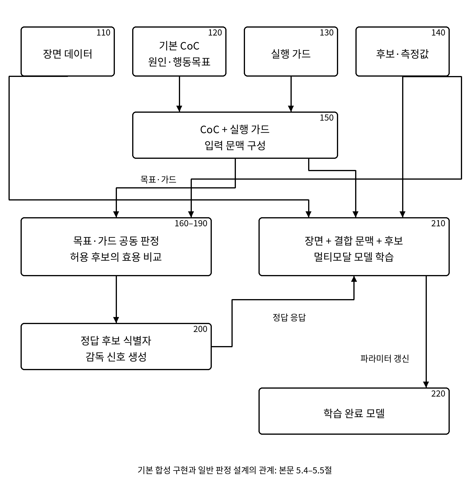
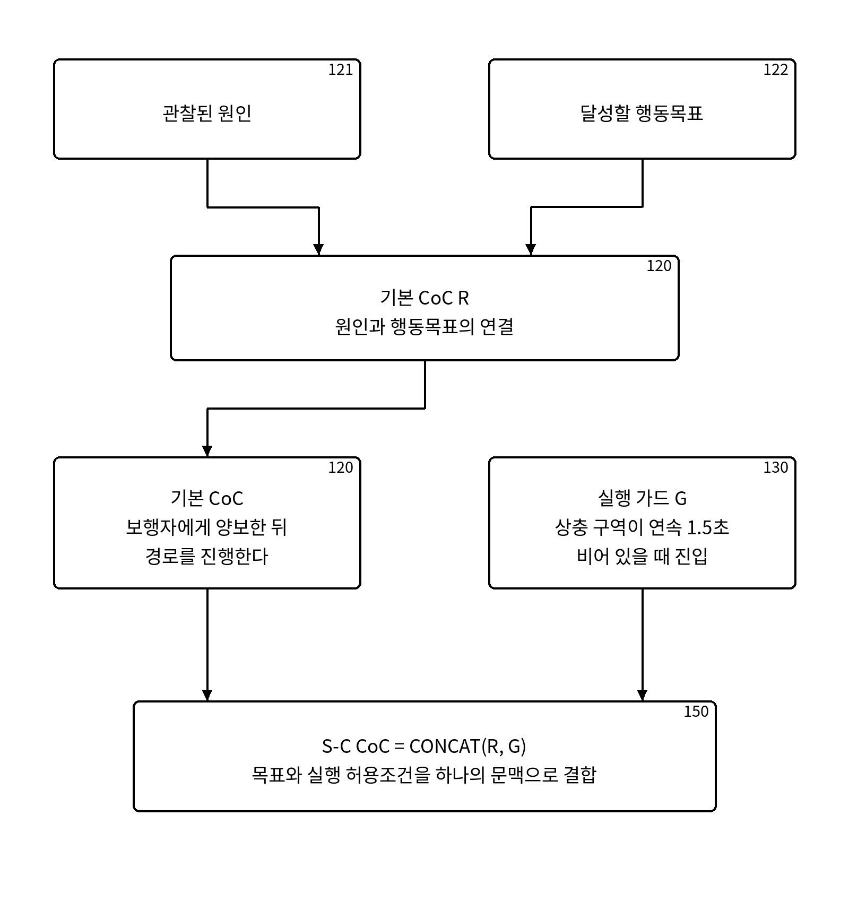
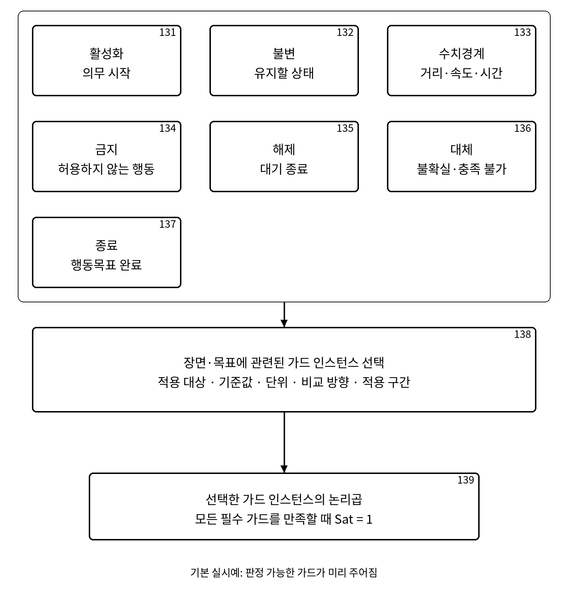
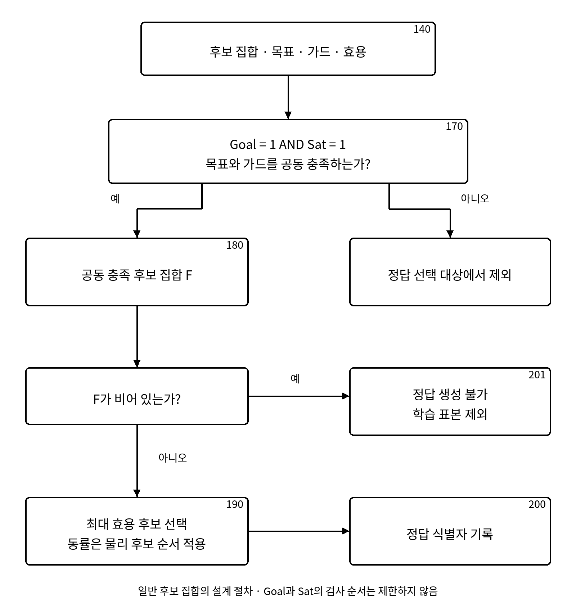
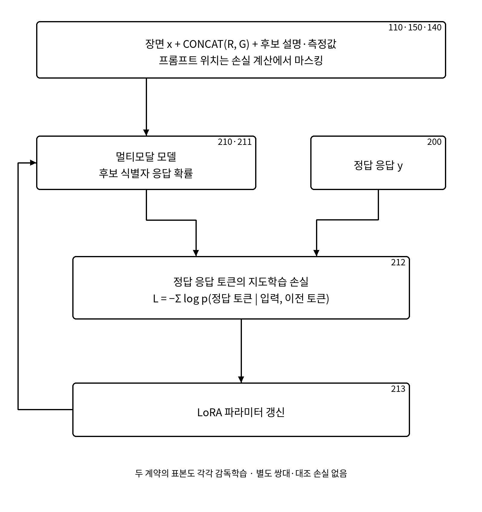
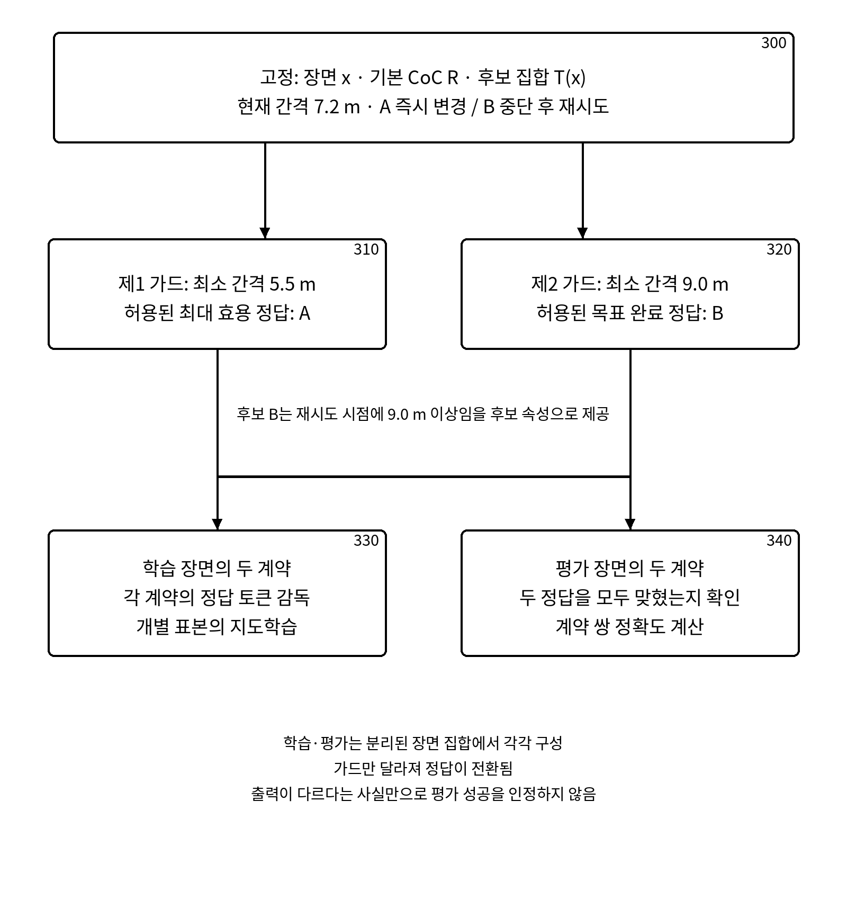
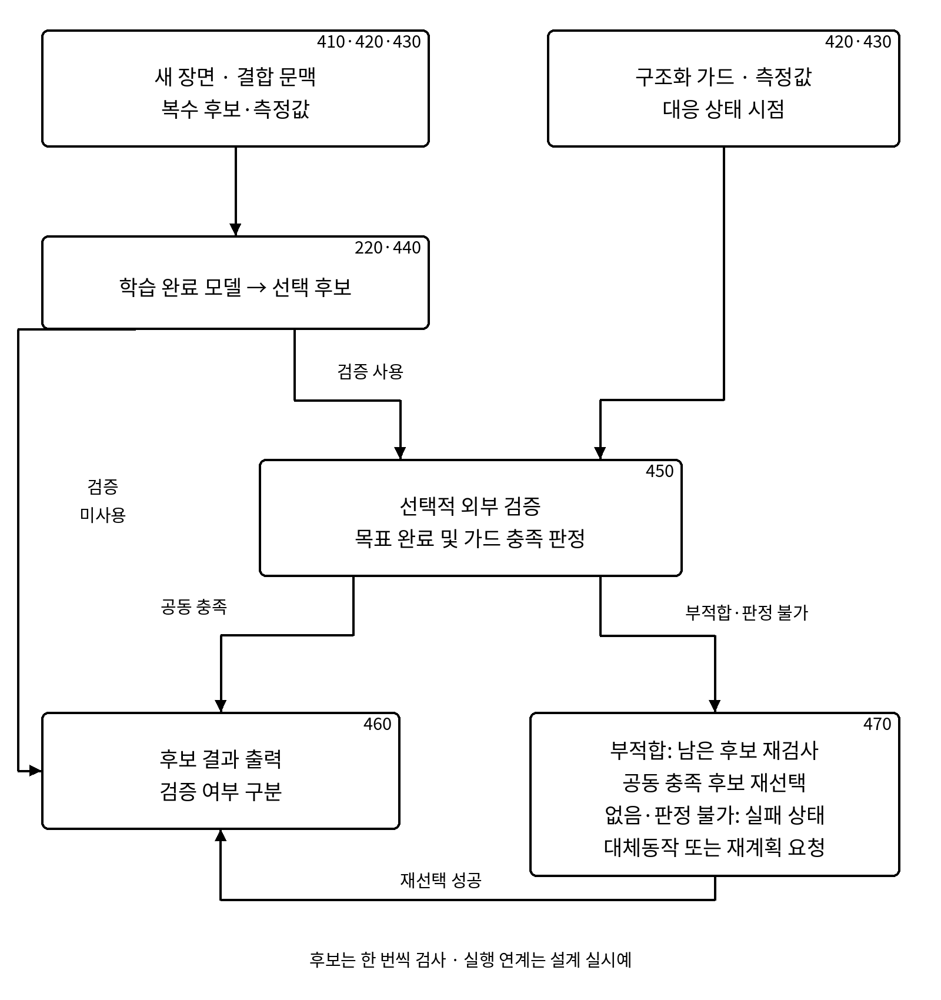

# 발명내용설명서

기술 검토용 수정본 · V02 · 2026-09-14

## 1. 발명의 명칭

국문: 실행 가드 통합형 인과 연쇄를 이용한 요구사항 부합 궤적 선택 모델의 학습 방법 및 장치

영문: Method and Apparatus for Training a Requirement-Conforming Trajectory Selection Model Using an Execution-Guard-Integrated Chain of Causation

본 문서는 기본 인과 연쇄와 실행 가드를 결합하고, 행동목표와 실행 가드를 공동 충족하는 후보로부터 학습 정답을 구성하여 궤적 후보 선택 모델을 학습하는 기술을 설명한다. 논문과 코드에서 확인된 합성 후보 선택 실험을 기본 실시예로 기술하고, 이를 일반적인 후보 집합과 선택적 실행 검증으로 확장하는 설계는 별도 실시예로 구분한다. 예비 청구범위는 기술 검토를 위한 문안이다.

## 2. 발명이 속하는 기술분야

본 발명은 자율주행 및 이동로봇의 비전-언어 인공지능, 학습자료 생성 및 궤적 후보 선택에 관한 것이다. 보다 구체적으로는 주행 장면의 원인과 행동목표를 설명하는 인과 연쇄(Chain-of-Causation, 이하 CoC)에 행동의 실행 허용조건을 나타내는 실행 가드를 결합하고, 해당 입력에 대응하는 목표·가드 공동 충족 정답을 이용하여 멀티모달 모델을 학습하는 컴퓨터 구현 방법, 장치 및 기록매체에 관한 것이다.

이하 제약 통합형 인과 연쇄는 Safety-Constrained CoC 또는 S-C CoC라 한다. 여기서 CoC는 Chain-of-Thought의 약어가 아니라 Chain-of-Causation을 뜻한다.

## 3. 발명의 배경 및 해결하려는 문제

### 3.1 기존 행동목표 설명의 한계

기본 CoC는 장면에서 관찰된 원인, 행동이 필요한 이유 및 달성할 목표를 설명한다. 예를 들어 “보행자가 차량의 이동 경로와 겹치는 구역에 있으므로 양보한 뒤 진행한다”는 문장은 행동의 원인과 목표를 연결한다. 그러나 정지 위치, 감속 한계, 출발 허용 시각과 같이 실행을 허용하는 구체적인 조건까지 항상 포함하지는 않는다.

그 결과 목표를 달성하더라도 정지선·차량 간격·속도·대기시간 등의 조건을 위반하는 후보가 선택될 수 있다. 반대로 위반을 회피하기 위해 평가 구간 내내 정지하면 진행 목표를 완료하지 못할 수 있다. 따라서 목표 완료와 가드 충족을 함께 반영하는 정답 생성 및 학습 절차가 필요하다.

### 3.2 해결하려는 기술적 과제

첫째, 기본 CoC의 원인·행동목표와 해당 행동의 실행 허용조건을 하나의 모델 입력 문맥으로 결합한다. 둘째, 각 입력에 주어진 목표와 가드를 함께 만족하는 후보를 학습 정답으로 선택한다. 셋째, 목표·가드를 충족하는 후보 사이에서는 진행도 또는 효용이 높은 후보를 선택하여 불필요한 목표 포기를 억제한다. 넷째, 같은 장면에서도 가드가 바뀌면 정답과 모델 선택이 바뀌도록 학습자료를 구성하고 그 사용 여부를 평가한다.

이 기술은 주어진 실행 가드에 조건화된 후보 선택의 학습을 대상으로 한다. 실제 도로에서 필요한 모든 가드를 자동 발견하거나 가드 자체의 충분성을 보장하는 기술은 기본 실시예에 포함하지 않는다.

## 4. 관련 공개기술과 비교할 구성

CoC와 궤적계획의 연결, 계획 제약을 포함한 프롬프트, 규칙 기반 궤적 평가 및 안전 점수에 기초한 모델 학습은 관련 공개문헌에 나타난다. 따라서 본 발명의 구성은 제약 문장의 추가 또는 학습의 존재만으로 설명하지 않고, 입력에 주어진 실행 가드와 행동목표를 정답 생성 조건에 연결하는 절차로 기술한다.

| 공개문헌 | 공개 내용 | 본 문서에서 구체적으로 대비하는 구성 |
|---|---|---|
| Alpamayo-R1 [1] | CoC 추론과 궤적계획, 추론·행동 정렬 | 실행 가드가 후보의 목표 공동 충족 정답을 결정하고 해당 정답을 모델 감독에 사용하는 관계 |
| KEPT [2] | 계획 제약을 포함한 CoT 프롬프트, 검색 및 단계별 미세조정 | 학습 여부 자체가 아니라 입력별 가드 판정에 따른 후보 정답 재구성 |
| Causal Scene Narration [3] | 의도·제약 정렬, 정량적 근거화, 실행 감독 및 선호 정렬 학습 | 동일 후보 집합에 서로 다른 가드를 적용하여 정답이 달라지는 데이터 구성 |
| DriveDPO [4] | 규칙 기반 안전 점수와 모방 유사도를 이용한 정책 학습 | 각 입력의 목표·가드를 필수조건으로 적용하고 허용집합 안에서 효용을 비교하는 정답 정의 |
| Neuro-Symbolic Drive [5] | 플래너의 활성 제약·후보·안전 게이트·선택 흔적을 이용한 감독학습 | 기본 CoC·외부 입력 가드·후보 측정값의 관계 및 가드 변경에 따른 정답 전환 |
| US20250153735A1 [6] | 장면·기존 계획·관련 교통규칙을 언어모델에 입력하여 새 계획 생성 | 주어진 후보들의 목표·가드 판정과 정답 후보 기반 모델 학습 |
| US11681296B2 [7] | 룰북 평가, 위반 정도의 점수화, 궤적 선택 및 차량 제어 | 평가 결과와 CoC·입력 가드를 연결하여 감독 표본을 생성하는 절차 |
| WO2023192497A1 [8] | 자연어 지시와 작업·환경 근거 평가를 이용한 로봇 스킬 선택 | 궤적 후보의 목표·가드 공동 충족 정답과 조건부 학습의 연결 |

위 표는 공개문헌과 비교할 기술 구성을 정리한 것이다. 각 문헌이 해당 구성을 전혀 포함하지 않는다는 판단이나 신규성·진보성의 결론을 나타내지 않는다. 특히 규칙 기반 정답을 모델에 학습시키는 구조와 계층적 규칙 평가에도 관련 기술이 있으므로, 학습 또는 필터 순서만을 독자적인 차별점으로 단정하지 않는다. 본문에서 다루는 쌍대 계약 구성은 예비 청구항 8–9에 구체화한다.

## 5. 발명의 주요 구성 및 작동

### 5.1 입력 데이터와 기능부

주행 장면 데이터를 x, 원인과 행동목표를 포함하는 기본 CoC를 R, 실행 가드를 G, 장면에 대응하는 유한 후보 집합을 T(x)라 한다. 기본 실시예의 학습 표본은 장면, 기본 CoC, 실행 가드, 후보 설명·측정 속성 및 정답 후보 식별자를 포함한다. 영상의 프레임 수와 후보 수는 과제에 따라 달라질 수 있다.

장면 데이터(110), 기본 CoC(120), 실행 가드(130) 및 후보·측정값(140)을 획득한다. 통합부(150)는 R과 G를 결합하여 모델 입력을 구성한다. 후보 평가부(160)와 정답 생성부(200)는 목표 완료 여부, 가드 충족 여부 및 효용을 이용해 감독 신호를 만든다. 모델 학습부(210)는 입력과 정답을 함께 사용하여 파라미터를 갱신한다. 도 1과 도 5에 입력 경로와 감독 경로를 구분하여 나타낸다.

### 5.2 CoC와 실행 가드의 결합

S-C CoC = CONCAT(R, G)

CONCAT은 기본 CoC의 원인·행동목표와 실행 가드를 하나의 입력 문맥으로 결합하는 연산이다. 기본 실시예에서는 자연어 가드를 기본 CoC 후단에 연결한다. 모델에는 결합된 문맥과 함께 장면 영상 및 후보 설명을 제공한다. 도 2의 기본 CoC(120)는 원인(121)과 행동목표(122)를 포함하며, 실행 가드(130)가 그 행동의 허용조건을 보완한다.

예를 들어 “보행자에게 양보한 뒤 진행한다”는 기본 CoC에 “상충 구역이 연속 1.5초 이상 비어 있을 때만 진입한다”는 가드를 결합한다. 가드는 목표를 대체하지 않고 목표의 실행 조건을 추가한다.

### 5.3 실행 가드의 구성요소와 판정 데이터

| 유형·부호 | 역할 | 예시 |
|---|---|---|
| 활성화 조건·131 | 실행 의무의 시작 | 보행자가 상충 구역에 있을 때 양보 의무 활성화 |
| 불변 조건·132 | 활성 구간 동안 유지할 상태 | 양보 중 정지선을 넘지 않음 |
| 수치경계·133 | 거리·속도·시간 등의 한계 | 최소 간격 6 m 이상, 감속도 크기 4 m/s² 이하 |
| 금지조건·134 | 특정 상태에서 배제할 행동 | 간격 미달 시 차선 변경을 계속하지 않음 |
| 해제조건·135 | 대기 의무의 해제 | 상충 구역이 연속 1.5초 이상 비었을 때 진입 허용 |
| 대체동작·136 | 판단 불가·충족 불가 시 처리 | 정지·대기·재계획 요청 등 사전 정의된 동작 |
| 종료조건·137 | 목표 완료의 판정 | 목표 차선 진입 완료와 요구 간격 유지 |

필요한 유형의 가드 인스턴스를 선택한 집합을 S(x,R)라 하고, 복수 가드는 논리곱으로 결합한다. 가드 유형과 구체적인 수치·대상·시간구간을 갖는 가드 인스턴스는 구분한다. 도 3의 선택 단계(138)에서 관련 인스턴스를 정하고 결합 단계(139)에서 G를 구성한다. 모든 장면에 일곱 유형을 전부 적용하는 것은 아니다.

기본 합성 실시예에서는 조건 종류, 비교 방향, 기준값·단위 및 해당 후보의 속성이 데이터 생성 과정에서 주어진다. 예를 들어 시간 가드는 연속 비점유가 시작된 시각 t_clear와 요구 유지시간 d를 이용하여 진입시각 t_entry가 t_clear + d 이상인지 판정한다. 거리 조건은 후보의 최소 간격과 요구 간격을 비교한다.

이러한 판정은 임의의 자연어 문장을 일반적으로 정확하게 해석하는 파서의 구현을 의미하지 않는다. 자연어와 구조화 값은 같은 계약 인스턴스를 표현하도록 작성한다. 입력 가드의 단위와 후보 측정값의 단위가 일치해야 하며, “미만”과 “이하”처럼 등호 포함 여부도 구분한다.

### 5.4 목표·가드 공동 충족 정답의 정의

Goal(τ,R)은 정해진 평가 구간 안에 후보 τ가 목표를 완료하는지, Sat(τ,G)는 후보가 적용된 가드를 만족하는지를 나타낸다. U(τ)는 후보의 진행도 또는 과제에서 정한 효용이다. 일반적인 정답 생성 정의는 다음과 같다.

F(x,R,G) = {τ ∈ T(x) : Goal(τ,R)=1 및 Sat(τ,G)=1}

τ* = SELECT_MAX_U(F)

SELECT_MAX_U는 F 안에서 U가 가장 큰 후보 하나를 선택한다. 목표와 가드의 공동 충족은 효용 비교에 앞선 자격 조건이다. Goal과 Sat이 동일 후보 속성에 대한 결정적 판정이라면 두 조건의 검사 순서를 바꾸거나 병렬로 검사하여도 같은 F를 얻는다. 특정 검사 순서 자체를 본 발명의 필수 효과로 전제하지 않는다.

일반 후보 집합을 위한 명시적 판정 실시예의 절차는 다음과 같다. 이 절차는 정답 정의를 일반적인 후보에 적용하는 설계이며, 기존 학습 코드를 새로 실행하거나 수정하였다는 뜻은 아니다.

```text
입력: 후보 집합 T, 행동목표 R, 실행 가드 G, 효용 U
1. 각 후보에 대해 목표 완료 여부와 가드 충족 여부를 판정한다.
2. 두 판정이 모두 참인 후보로 집합 F를 구성한다.
3. F가 비어 있으면 해당 입력을 정답 생성 불가로 표시하고 학습 표본에서 제외한다.
4. F에서 최대 효용 후보를 선택한다.
5. 동률이면 후보 문자 재배치 전에 정한 물리 후보 순서로 하나를 선택한다.
6. 선택 후보의 현재 식별자를 학습 정답으로 기록한다.
```

단계 3과 5는 후보가 없거나 동률인 경우의 확장 설계다. 기존 합성 실시예는 각 계약에서 허용되는 목표 완료 후보가 존재하고 정답이 분명하도록 만들어졌다. 동률 선택 규칙은 문자 A/B/C/D를 항상 선호하는 규칙과 구분한다. 도 4는 공동 판정, 허용집합, 정답 생성 불가 분기와 효용 비교를 나타낸다.

### 5.5 논문에서 사용한 합성 구현과의 관계

정적 과제는 두 후보가 모두 행동목표를 완료하도록 구성하고, 가드 충족 후보 중 진행도가 큰 후보를 정답으로 선택한다. 시간 과제와 다중 주행 과제에서는 끝까지 정지하는 교착 후보를 비위반 후보로 남겨 두되 진행도를 0으로 부여한다. 동시에 가드에 부합하는 목표 완료 후보가 더 높은 진행도를 갖도록 구성한다.

따라서 이 합성 후보 구성에서는 가드 충족 후보 중 최대 진행도를 선택한 결과가 5.4절의 목표·가드 공동 충족 정답과 일치한다. 그러나 기존 코드가 목표 미완료 후보를 먼저 명시적으로 제거하는 것은 아니다. 목표 미완료 후보가 더 높은 효용을 갖거나 공동 충족 후보가 없는 일반 후보 집합에서는 동일성이 성립하지 않을 수 있으므로 5.4절의 명시적 공동 판정 절차가 필요하다.

본 문서의 교착 후보는 “평가 구간 내 목표를 완료하지 못하는 정지·대기 후보”라는 과제상 정의다. 무한 시간 동안 진행할 수 없다는 의미의 영구 교착을 검증한 것은 아니다.

### 5.6 학습자료 구성 및 모델 파라미터 갱신

하나의 학습 입력 z는 장면 영상, CONCAT(R,G), 복수 후보의 설명·측정값 및 허용되는 목표 완료 후보 중 진행도가 큰 후보를 선택하라는 지시로 구성된다. 모델의 학습 목표 y는 정답 후보 식별자를 포함하는 응답 토큰열이다.

L(θ) = −Σ log pθ(y_j | z, y_<j)

합은 정답 응답의 감독 대상 토큰에 적용한다. 기본 구현은 프롬프트 위치를 손실 계산에서 마스킹하고 정답 응답에 대한 언어모델 지도학습 손실을 사용한다. Qwen3-VL-2B-Instruct의 언어 주의 모듈에 LoRA를 적용하여 학습 가능한 추가 파라미터를 갱신한다. 후보 식별자를 답하는 방식이므로 연속 궤적 좌표를 직접 회귀하는 모델과 구분된다.

후보 식별자와 실제 행동 역할의 대응은 장면에 따라 바꾼다. 시간 과제의 실시예는 후보 문자를 순환 배치하여 특정 문자가 항상 짧은 대기 또는 긴 대기를 뜻하지 않도록 한다. 학습·평가 장면도 구분한다.

도 5에서 모델(210)은 입력을 받아 응답 확률(211)을 계산하고, 정답(200)과 함께 손실(212)을 구성하여 파라미터 갱신(213)을 수행한다. 학습 후 결과는 학습 완료 모델(220)이다. 모델 학습의 목적은 주어진 가드에 조건화된 선택 관계를 학습시키는 것이다. 정답 생성기보다 빠르거나 계산 비용이 낮다는 효과는 현재 실험으로 입증한 바 없다.

### 5.7 쌍대 계약의 학습 및 평가 사용

동일한 장면 x, 기본 CoC R 및 후보 집합 T(x)를 유지하고 서로 다른 G1과 G2를 적용한다. 두 가드에 대응하는 정답 τ1*와 τ2*가 달라지는 장면을 쌍대 계약으로 구성한다. 바뀌는 요소는 최소 간격, 요구 대기시간 등 실행 허용조건이다.

실제 시간 과제의 데이터 생성은 학습과 평가 모두에서 각 장면에 짧은 대기와 긴 대기의 두 계약을 생성한다. 학습은 이들을 개별 감독 표본으로 사용하며, 모델은 각 입력에 대응하는 정답 응답을 학습한다. 두 표본이 항상 같은 미니배치에 놓이거나 두 출력 사이에 별도 대조 손실을 적용하는 방식은 기본 구현에 포함되지 않는다.

평가에서는 두 계약의 정답을 모두 맞힌 장면의 비율을 계약 쌍 정확도로 계산한다. 출력이 서로 다르다는 사실만으로 성공으로 판정하지 않는다. 두 출력은 각각 해당 계약의 올바른 후보여야 한다. 도 6은 계약 생성 후 개별 감독학습에 사용하는 경로와 쌍 정확도를 계산하는 경로를 분리한다.

### 5.8 제약·정답 대응 교란 통제

가드와 정답 사이의 의미 대응을 확인하기 위해 가드 문장을 다른 학습 표본의 정답과 대응시키는 교란 조건을 별도로 구성한다. 올바른 대응 자료로 학습한 모델과 교란 자료로 학습한 통제 모델을 올바른 계약의 평가 자료에서 비교한다. 비교 시 가드의 입력 위치와 학습 조건을 맞춘다.

이 조건은 대응 관계를 학습하는 효과를 측정하기 위한 음성 통제다. 잘못된 대응을 정상 모델에 추가하여 성능을 개선하는 hard-negative 학습으로 설명하지 않는다. 별도 쌍대·대조 손실 및 hard-negative 개선 학습은 이 수정본의 구현 근거와 예비 청구범위에 포함하지 않는다.

### 5.9 추론 및 선택적 외부 검증

학습 완료 모델은 새 장면, 기본 CoC와 실행 가드의 결합 문맥 및 후보 설명을 입력받아 후보 식별자를 출력한다. 선택된 후보의 측정값을 가드와 비교하여 결과를 평가하는 사후 검증은 기본 실험에 포함된다.

선택적 실행 검증 실시예에서는 구조화 가드, 후보 측정값 및 이들이 대응하는 상태 시점을 검증부(450)에 제공한다. 검증부는 목표 완료와 가드 충족을 재판정한다. 부적합 후보가 선택되면 남은 후보를 다시 검사하고, 공동 충족 후보가 있으면 효용이 큰 후보를 대안으로 선택한다. 후보는 한 번씩만 검사하여 유한 후보 수 안에 절차를 종료한다. 공동 충족 후보가 없거나 판정 입력이 불충분하면 정답 선택 실패를 알리고 사전 정의된 대체동작 또는 재계획 요청(470)을 출력한다.

정지·대기라는 대체동작 자체가 어떤 환경에서도 안전하다는 의미는 아니다. 해당 동작의 적용 가능성과 가드의 타당성은 별도의 시스템 조건에 따른다. 도 7은 검증을 사용하는 경우의 입력·결과 경로와 검증을 사용하지 않는 후보 출력 경로를 구분한다.

이 재선택·대체동작 절차는 실행 연계를 위한 설계 실시예다. Qwen 후보 선택 모델에 결합한 실시간 차량 제어 실험을 완료하였다는 의미가 아니다. 다른 소형 신경망을 사용한 논문의 보조 폐루프 결과와도 구분한다.

## 6. 구체적인 실시예

### 6.1 시간 가드에 따른 정답 전환

기본 CoC는 “상충 구역에 있는 보행자에게 양보한 뒤 경로를 진행한다”이다. 상충 구역은 시각 3.0초부터 계속 비어 있다고 설정한다. 후보의 목표 완료는 평가 구간 내 경로 완료 여부이며, 네 후보의 설명과 진행도는 두 계약에서 동일하다. 아래 표의 수치는 합성 시간 과제의 생성 규칙에 맞춘 설명용 사례다.

완화 계약 G1은 연속 비점유 유지시간 0.5초를 요구하여 진입시각 3.5초 이상을 허용한다. 엄격 계약 G2는 1.5초를 요구하여 4.5초 이상을 허용한다. 경계값과 같은 시각의 진입은 허용한다.

| 후보 | 행동·진입시각 | Goal | U·진행도 | Sat(G1) | Sat(G2) | 정답 관계 |
|---|---|---|---|---|---|---|
| A | 조기 진입·2.5초 | 1 | 110 m | 0 | 0 | 두 계약에서 위반 |
| B | 짧은 대기 후 진입·3.5초 | 1 | 100 m | 1 | 0 | G1의 정답 |
| C | 긴 대기 후 진입·4.5초 | 1 | 85 m | 1 | 1 | G2의 정답 |
| D | 평가 종료까지 정지 | 0 | 0 m | 1 | 1 | 목표 미완료 |

G1의 공동 충족 집합은 B와 C이며 효용이 높은 B를 정답으로 선택한다. G2의 공동 충족 집합은 C이므로 정답은 C다. D는 가드를 위반하지 않지만 목표를 완료하지 못한다. 기존 합성 코드가 D를 가드 충족 집합에 남기더라도 진행도가 0이므로 두 계약의 정답은 동일하게 B와 C가 된다.

학습 입력의 예는 다음과 같다. 실제 과제에서는 같은 내용을 영어 프롬프트와 합성 영상으로 제공하며 후보 문자의 역할을 장면별로 바꾼다.

```text
장면: 상충 구역은 3.0초부터 연속으로 비어 있음.
CoC: 보행자에게 양보한 뒤 경로를 진행한다.
가드: 비점유 상태가 0.5초 이상 유지된 뒤에만 진입한다.
후보: A=2.5초 진입/110 m, B=3.5초 진입/100 m,
      C=4.5초 진입/85 m, D=정지 유지/목표 미완료/0 m.
지시: 가드를 만족하며 목표를 완료하는 후보 중 진행도가 가장 큰 후보를 선택한다.
정답 응답: B
```

같은 장면·목표·후보에서 가드의 요구시간만 1.5초로 바꾸면 정답 응답은 C다. 이는 한 장면에 정답이 임의로 두 개 부여된 경우가 아니라, 모델 입력의 가드가 달라져 조건부 정답이 달라지는 경우다.

### 6.2 차선 변경 실시예

기본 CoC는 “전방 차로의 장애물로 인해 목표 차선으로 변경한다”이다. 현재 차량 간격은 7.2 m이며 후보 A는 즉시 차선 변경, 후보 B는 중단 후 필요한 간격이 확보되면 재시도하는 행동을 나타낸다. 이 사례에서는 두 후보가 각각 명시된 미래 속성에 따라 목표를 완료한다고 가정한다.

완화 계약의 최소 간격은 5.5 m, 엄격 계약은 9.0 m다. 완화 계약에서는 7.2 m가 5.5 m 이상이므로 A가 허용되고 더 큰 진행도로 선택된다. 엄격 계약에서는 현재 간격이 9.0 m 미만이므로 A가 제외된다. B는 후보에 기록된 재시도 시점의 간격이 9.0 m 이상이고 목표를 완료할 때 정답이 된다. 현재 간격만으로 B의 미래 가드 충족을 자동 인정하지 않는다. 도 6과 본문의 완화 기준은 모두 5.5 m로 통일한다.

### 6.3 복수 가드와 후보 소진의 설계 실시예

하나의 후보에 최소 간격, 최대 감속도 크기 및 최대 가가속도 크기를 함께 적용할 수 있다. 각 비교 방향과 단위를 통일하고 모든 필수 가드가 참일 때 Sat=1로 판정한다. 일부 가드만 만족하는 높은 진행도 후보는 정답이 될 수 없다.

일반적인 입력에서 공동 충족 후보가 없으면, 학습자료 생성 단계에서는 정답 생성 불가 상태를 기록하고 해당 표본을 제외한다. 실행 연계 단계에서는 실패 상태와 사전 정의된 대체동작 또는 재계획 요청을 구분하여 출력한다. 이 처리는 목표 미완료 동작을 목표 완료 정답으로 재정의하지 않는다.

## 7. 발명의 효과 및 확인된 실험 근거

### 7.1 기술적 효과

첫째, 원인·목표 문맥과 실행 허용조건을 정답 생성 및 모델 감독에 연결할 수 있다. 둘째, 정답 정의상 목표 미완료 후보와 가드 위반 후보를 배제하고 공동 충족 후보 중 효용이 높은 후보를 선택할 수 있다. 셋째, 동일 장면의 가드 변경에 따른 정답 전환을 학습·평가에 사용하여 모델이 가드 정보를 실제 선택에 반영하는지 측정할 수 있다. 넷째, 선택 결과의 수치 판정을 모델 외부 계산으로 분리할 수 있다.

정답 생성 단계의 배제 규칙은 학습된 모델이 모든 추론에서 반드시 준수한다는 보장이 아니다. 모델의 실제 준수 수준은 평가 분포와 검증 결과로 확인한다.

### 7.2 기본 실시예에서 확인된 결과

기반 모델은 Qwen3-VL-2B-Instruct이며 LoRA를 사용하였다. 시간 과제는 seed 42, 17, 123의 세 반복으로 수행했고 각 반복에서 학습 192장면·384계약 예, 평가 48장면·96계약 예를 사용했다. 표준 평가는 학습에 쓰지 않은 장면이되 문장 틀과 수치 범위는 학습 자료와 같다. 아래 값은 기반 논문에 보고된 결과다.

| 평가·조건 | 가드 위반률 | 가드 준수 목표 완료율 | 후보 정확도 | 계약 쌍 정확도 |
|---|---|---|---|---|
| 표준 시간·기본 CoC | 0.319 ± 0.052 | 0.681 ± 0.052 | 0.500 | 0.000 |
| 표준 시간·제약 통합 CoC | 0.000 ± 0.000 | 1.000 | 1.000 | 1.000 |
| 미관측 시간값·제약 통합 CoC | 0.351 | 0.649 | 0.635 | 0.306 |

±는 세 반복의 평균과 모집단 표준편차다. 기본 CoC 조건은 두 시간 계약을 구별할 제약 정보가 없는 기준선이다. 따라서 이 조건과의 차이 전체를 입력 결합 형식만의 효과로 해석하지 않는다. 같은 입력 형식에서 올바른 가드·정답 대응과 교란 대응을 비교하는 평가를 함께 사용한다.

### 7.3 증거의 범위

실험은 합성 영상과 수치 속성이 제공된 후보 중 하나를 선택하는 과제다. 미관측 시간값에서는 위반률이 다시 증가하므로 일반적인 수치 외삽 능력이나 모든 가드의 준수를 입증하지 않는다. 시간 과제에서는 영상 정보에 대한 의존성이 관찰되었지만, 다중 주행 과제 일부는 영상 정보를 바꿔도 높은 정확도를 유지하였다. 전체 결과를 실제 도로 시각 이해의 개선으로 일반화하지 않는다.

후보 속성·정답·검증 규칙은 같은 합성 과제 정의에서 구성되었다. 외부 검증기는 모델과 분리된 결정적 계산이지만 독립된 실제 도로 안전 정답은 아니다. 실제 가드 자동 생성, 연속 궤적 생성, 차량의 실시간 실행 차단 및 실차 안전성은 기본 실험이 입증한 범위가 아니다.

## 8. 예비 청구범위

다음 문안은 발명자의 기술 내용 확인과 출원 문서 검토를 위한 초안이다. 일반적인 공동 충족 정답 생성, 쌍대 표본의 개별 감독학습 및 선택적 실행 검증을 구분하여 기재한다.

### 청구항 1. 학습 방법

자율주행 궤적 후보 선택 모델을 학습하는 컴퓨터 구현 방법에 있어서,

주행 장면 데이터 및 상기 주행 장면에 관련된 원인과 달성할 행동목표를 포함하는 기본 인과 연쇄를 획득하는 단계;

상기 행동목표의 실행 허용조건을 나타내는 실행 가드 및 복수의 궤적 후보와 각 후보의 측정 속성을 획득하는 단계;

상기 기본 인과 연쇄와 실행 가드를 하나의 입력 문맥으로 결합하여 제약 통합형 인과 연쇄를 구성하는 단계;

상기 복수의 궤적 후보에 대하여 행동목표 완료 여부 및 실행 가드 충족 여부를 판정하고, 상기 행동목표와 실행 가드를 공동 충족하는 후보들의 집합을 정하는 단계;

상기 집합이 비어 있지 않은 경우 상기 집합에 속하는 후보 중 진행도에 따른 효용값이 최대인 후보를 정답 후보로 설정하는 단계; 및

상기 주행 장면 데이터, 제약 통합형 인과 연쇄 및 복수 후보의 설명과 측정 속성을 모델 입력으로 사용하고 상기 정답 후보의 식별자를 포함하는 응답을 감독 목표로 사용하여 멀티모달 궤적 후보 선택 모델의 파라미터를 갱신하는 단계를 포함하는 학습 방법.

### 청구항 2

청구항 1에 있어서, 상기 실행 가드는 활성화 조건, 불변 조건, 수치경계, 금지조건, 해제조건, 대체동작 및 종료조건 중 하나 이상의 유형에 해당하는 가드 인스턴스를 포함하는 학습 방법.

### 청구항 3

청구항 1에 있어서, 상기 실행 가드는 자연어 문장으로 표현되고 상기 기본 인과 연쇄의 후단에 연결되어 단일 입력 문맥을 구성하는 학습 방법.

### 청구항 4

청구항 1에 있어서, 상기 측정 속성은 정지선 상대위치, 최대 속도, 최대 감속도 크기, 최대 가가속도 크기, 최소 차량 간격 및 상충 구역 진입시각 중 하나 이상을 포함하고, 상기 실행 가드에 대응하는 비교 방향 및 단위를 사용하여 충족 여부를 판정하는 학습 방법.

### 청구항 5

청구항 1에 있어서, 상기 후보들의 집합을 정하는 단계는 목표 완료 여부와 가드 충족 여부의 논리곱이 참인 후보를 정답 선택 대상에 포함하며, 상기 두 판정을 순차 또는 병렬로 수행하는 학습 방법.

### 청구항 6

청구항 1에 있어서, 상기 행동목표 완료 여부는 정해진 평가 구간 내에 목표가 완료되었는지에 따라 판정되고, 상기 평가 구간 내 목표를 완료하지 못하는 정지 또는 대기 후보는 실행 가드를 충족하더라도 상기 정답 선택 대상에서 제외되는 학습 방법.

### 청구항 7

청구항 1에 있어서, 후보 식별자와 실제 행동 역할의 대응을 장면별로 변경하고, 변경된 식별자와 대응하는 물리 후보의 관계를 유지하여 학습 정답을 기록하는 학습 방법.

### 청구항 8

청구항 1에 있어서, 동일한 주행 장면 데이터, 기본 인과 연쇄 및 후보 집합을 유지하면서 서로 다른 제1 실행 가드와 제2 실행 가드를 적용하고, 각 가드에 따라 서로 다른 제1 정답 후보 및 제2 정답 후보를 생성하여 두 학습 표본을 구성하는 학습 방법.

### 청구항 9

청구항 8에 있어서, 상기 두 학습 표본 각각의 실행 가드를 기본 인과 연쇄와 결합하고, 각 표본의 정답 후보 식별자를 포함하는 응답 토큰에 대한 지도학습 손실을 이용하여 상기 모델의 파라미터를 갱신하는 학습 방법.

### 청구항 10

청구항 1에 있어서, 가드 문장과 정답 후보의 대응을 다른 학습 표본 사이에서 교란한 자료를 이용하여 별도의 비교 모델을 학습하고, 올바른 가드·정답 대응을 갖는 평가 자료에서 상기 모델과 비교 모델을 비교하여 실행 가드 조건에 대한 선택 반응을 평가하는 단계를 더 포함하는 학습 방법.

### 청구항 11

청구항 1에 있어서, 상기 멀티모달 모델은 비전-언어 모델이고, 상기 파라미터의 갱신은 정답 응답 토큰을 감독 대상으로 하는 언어모델 학습 손실 및 LoRA에 의한 파라미터 효율적 미세조정을 이용하는 학습 방법.

### 청구항 12

청구항 1에 있어서, 복수의 실행 가드가 적용되는 경우 각 가드 인스턴스의 판정 결과를 논리곱으로 결합하여 상기 실행 가드의 충족 여부를 정하는 학습 방법.

### 청구항 13. 후보 선택 방법

궤적 후보를 선택하는 컴퓨터 구현 방법에 있어서,

주행 장면 데이터, 원인과 행동목표를 포함하는 기본 인과 연쇄, 상기 행동목표의 실행 허용조건인 실행 가드 및 설명과 측정 속성을 갖는 복수의 궤적 후보를 획득하는 단계;

상기 기본 인과 연쇄와 실행 가드를 하나의 입력 문맥으로 결합하는 단계; 및

상기 주행 장면 데이터, 결합된 입력 문맥 및 복수 후보를 멀티모달 후보 선택 모델에 입력하여 하나의 후보 식별자를 출력하는 단계를 포함하고,

상기 모델은 학습 표본별로 행동목표와 실행 가드를 공동 충족하는 후보 중 효용값이 최대인 후보의 식별자를 감독 목표로 사용하여 학습된 모델인, 궤적 후보 선택 방법.

### 청구항 14

청구항 13에 있어서, 구조화된 실행 가드와 후보 측정값을 이용하여 선택된 후보의 목표 완료 여부 및 가드 충족 여부를 결정적으로 검증하고, 공동 충족하지 않는 경우 남은 후보를 검사하여 공동 충족 후보를 재선택하며, 그러한 후보가 없거나 판정에 필요한 입력이 불충분한 경우 선택 실패 상태와 사전 정의된 대체동작 또는 재계획 요청을 출력하는 단계를 더 포함하는 후보 선택 방법.

### 청구항 15. 학습 장치

하나 이상의 프로세서 및 상기 프로세서가 실행할 명령을 저장하는 메모리를 포함하는 궤적 후보 선택 모델 학습 장치에 있어서,

상기 명령은 상기 프로세서로 하여금 주행 장면 데이터, 원인과 행동목표를 포함하는 기본 인과 연쇄, 실행 가드 및 복수의 궤적 후보와 측정 속성을 획득하고, 상기 기본 인과 연쇄와 실행 가드를 하나의 입력 문맥으로 결합하고, 상기 행동목표와 실행 가드를 공동 충족하는 후보 집합이 비어 있지 않은 경우 그 집합 안에서 효용값이 최대인 후보를 정답으로 정하며, 상기 주행 장면 데이터, 결합 문맥 및 후보 설명·측정값을 입력으로 하고 상기 정답의 후보 식별자를 감독 목표로 하여 멀티모달 후보 선택 모델의 파라미터를 갱신하도록 하는 학습 장치.

### 청구항 16

청구항 15에 있어서, 상기 명령은 상기 프로세서로 하여금 동일 장면·기본 인과 연쇄·후보 집합에 서로 다른 두 가드를 적용하여 서로 다른 정답을 갖는 계약 쌍을 구성하고, 각 계약의 정답을 개별 감독 표본으로 이용하도록 하는 학습 장치.

### 청구항 17

청구항 15에 있어서, 상기 명령은 상기 프로세서로 하여금 학습된 모델의 선택 후보에 대해 구조화된 가드와 측정값을 비교하여 가드 충족 여부를 결정적으로 계산하는 검증 기능을 더 수행하도록 하는 학습 장치.

### 청구항 18. 컴퓨터 판독 가능한 기록매체

하나 이상의 프로세서에서 실행될 때 상기 프로세서로 하여금 주행 장면 데이터, 원인과 행동목표를 포함하는 기본 인과 연쇄, 실행 가드 및 복수의 궤적 후보와 측정 속성을 획득하는 단계, 상기 기본 인과 연쇄와 실행 가드를 하나의 입력 문맥으로 결합하는 단계, 상기 행동목표와 실행 가드를 공동 충족하는 후보 집합이 비어 있지 않은 경우 그 집합 안에서 효용값이 최대인 후보를 정답으로 정하는 단계, 및 상기 주행 장면 데이터·결합 문맥·후보 설명과 측정값을 입력으로 하고 상기 정답 후보의 식별자를 감독 목표로 하여 멀티모달 후보 선택 모델의 파라미터를 갱신하는 단계를 수행하게 하는 명령을 저장한 비일시적 컴퓨터 판독 가능한 기록매체.

## 9. 적용 분야 및 기업화 형태

적용 분야는 자율주행·VLA 모델의 요구사항 조건부 미세조정, 궤적 후보 선택용 학습자료 생성, 시뮬레이터 기반 계약 시험 및 모델의 가드 민감도 평가이다. 이동로봇의 유한 행동 후보 선택에도 같은 입력·정답 관계를 적용하는 방안을 검토할 수 있다.

기업화 형태로는 가드 조건부 학습데이터 생성 소프트웨어, 기존 모델을 위한 미세조정 도구, 계약 쌍을 이용한 회귀평가 모듈 및 시뮬레이터 연계 서비스가 가능하다. 이는 적용·사업화 방향이며, 시장 규모, 매출, 실제 고객 도입이나 실차 제품 성능을 검증한 결과는 아니다. 실제 차량 적용에는 센서 상태에 대응하는 계약, 후보의 물리적 실행 가능성 및 독립된 환경 검증이 추가로 필요하다.

## 10. 요약서

본 발명은 실행 가드 통합형 인과 연쇄를 이용하여 요구사항 부합 궤적 후보 선택 모델을 학습하는 방법에 관한 것이다. 주행 장면의 원인과 행동목표를 포함하는 기본 인과 연쇄와 실행 허용조건을 나타내는 실행 가드를 획득하고 이를 하나의 입력 문맥으로 결합한다. 복수 후보의 목표 완료 여부와 가드 충족 여부를 판정하여 두 조건을 공동 충족하는 후보를 정하고, 그러한 후보가 존재하면 효용값이 최대인 후보를 정답으로 선택한다. 장면, 결합 문맥 및 후보 설명·측정값을 모델 입력으로 하고 정답 후보의 식별자를 감독 목표로 하여 모델 파라미터를 갱신한다. 동일한 장면·목표·후보에 서로 다른 가드를 적용하여 서로 다른 정답을 갖는 학습 표본을 구성할 수 있다. 이에 따라 목표를 달성하지만 가드를 위반하는 후보와 목표를 완료하지 못하는 후보를 정답에서 배제하고, 가드에 따라 달라지는 선택 관계를 학습시킬 수 있다.

## 11. 도면의 간단한 설명 및 부호

대표도면은 도 1이다. 도 1은 입력 획득, 정답 생성 및 모델 학습의 전체 흐름을 나타낸다. 도 2는 기본 CoC와 실행 가드의 결합 구조를 나타낸다. 도 3은 실행 가드의 유형과 인스턴스 구성을 나타낸다. 도 4는 일반 후보 집합에 대한 공동 충족 판정과 정답 생성 불가 분기를 나타낸다. 도 5는 정답 응답 지도학습의 입력·손실·갱신 경로를 나타낸다. 도 6은 동일 장면의 가드 변경에 따른 학습 표본과 평가 쌍을 나타낸다. 도 7은 학습 모델의 후보 선택과 선택적 외부 검증 경로를 나타낸다.

| 부호 | 명칭 |
|---|---|
| 110 / 120 / 121 / 122 | 장면 데이터 / 기본 CoC / 원인 / 행동목표 |
| 130 / 131–137 | 실행 가드 / 활성화·불변·수치경계·금지·해제·대체·종료 유형 |
| 138 / 139 | 관련 가드 인스턴스 선택 / 복수 가드 결합 |
| 140 / 150 / 160 | 후보·측정값 / CoC·가드 통합 / 후보 평가 |
| 170 / 180 / 190 / 200 | 공동 충족 판정 / 허용집합 / 효용 비교 / 정답 후보 |
| 201 | 정답 생성 불가·학습 표본 제외 |
| 210 / 211 / 212 / 213 / 220 | 모델 학습부 / 응답 확률 / 지도학습 손실 / 파라미터 갱신 / 학습 완료 모델 |
| 300 / 310 / 320 / 330 / 340 | 고정 장면·목표·후보 / 제1 계약 / 제2 계약 / 개별 감독학습 / 계약 쌍 평가 |
| 410 / 420 / 430 / 440 | 새 장면 / 결합 문맥 / 후보·측정값 / 선택 후보 |
| 450 / 460 / 470 | 선택적 검증 / 결과 출력 / 실패·대체동작·재계획 요청 |

<!-- pagebreak -->

### 도 1. 실행 가드 조건부 학습의 전체 흐름



장면·결합 문맥·후보는 모델 입력으로 전달되고, 공동 충족 후보에서 선택한 정답은 별도의 감독 신호로 전달된다. 실제 합성 구현과 일반 후보 판정 설계의 관계는 5.4–5.5절에 따른다.

<!-- pagebreak -->

### 도 2. 기본 CoC와 실행 가드의 결합



원인과 행동목표를 포함하는 기본 CoC에 실행 허용조건을 추가하여 하나의 문맥을 구성한다. 후보 설명과 영상은 모델의 별도 입력 요소다.

<!-- pagebreak -->

### 도 3. 실행 가드의 유형과 인스턴스 구성



유형 자체와 구체적인 대상·기준값·단위·구간을 갖는 가드 인스턴스를 구분한다. 기본 실시예에서는 판정 가능한 가드 인스턴스가 미리 주어진다.

<!-- pagebreak -->

### 도 4. 공동 충족 정답 생성의 일반 절차



목표와 가드의 판정은 순차 또는 병렬로 수행할 수 있다. 허용집합이 없으면 정답을 억지로 부여하지 않는다. 이는 일반 후보 집합을 위한 설계이며 기존 코드의 직접 실행 순서를 묘사한 것은 아니다.

<!-- pagebreak -->

### 도 5. 정답 응답에 대한 지도학습



프롬프트 위치는 손실 대상에서 마스킹하고 정답 응답 토큰을 감독한다. 기본 구현은 개별 표본의 지도학습이며 전용 쌍대·대조 손실을 포함하지 않는다.

<!-- pagebreak -->

### 도 6. 쌍대 계약의 학습 및 평가



현재 간격 7.2 m, 완화 기준 5.5 m, 엄격 기준 9.0 m를 사용한다. 후보 B의 재시도 시점 간격은 엄격 가드에 부합한다고 후보 속성에 명시한다. 학습 표본과 계약 쌍 평가는 목적이 다르다.

<!-- pagebreak -->

### 도 7. 후보 선택과 선택적 외부 검증



외부 검증을 사용하면 가드·측정값·상태 시점을 함께 제공한다. 검증 미사용 경로의 후보 출력은 검증 통과를 뜻하지 않는다. 부적합 시 재선택·대체동작은 실행 연계 설계 실시예다.

<!-- pagebreak -->

## 12. 참고문헌 및 기술 근거

[1] Alpamayo-R1: Bridging Reasoning and Action Prediction for Generalizable Autonomous Driving in the Long Tail. arXiv:2511.00088. https://arxiv.org/abs/2511.00088

[2] KEPT: Knowledge-Enhanced Prediction of Trajectories from Consecutive Driving Frames with Vision-Language Models. arXiv:2509.02966. https://arxiv.org/abs/2509.02966

[3] Causal Scene Narration with Runtime Safety Supervision for Vision-Language-Action Driving. arXiv:2604.01723. https://arxiv.org/abs/2604.01723

[4] DriveDPO: Policy Learning via Safety DPO for End-to-End Autonomous Driving. arXiv:2509.17940. https://arxiv.org/abs/2509.17940

[5] Neuro-Symbolic Drive: Rule-Grounded Faithful Reasoning for Driving VLAs. arXiv:2606.23938. https://arxiv.org/abs/2606.23938

[6] US20250153735A1, Techniques for Adaptive Driving Using Language Models. https://patents.google.com/patent/US20250153735A1/en

[7] US11681296B2, Scenario-Based Behavior Specification and Validation. https://patents.google.com/patent/US11681296B2/en

[8] WO2023192497A1, Natural Language Control of a Robot. https://patents.google.com/patent/WO2023192497A1/en

기반 논문: 「비전-언어 자율주행 모델의 실행 가드 기반 궤적 후보 선택: Safety-Constrained Chain-of-Causation」, 제공된 latex-kiee-review-2022 원고의 3·4·5·7·8장.

구현 대조: temporal_guard_world.py의 make_scene·target_for·generate_temporal_examples, maneuver_guard_world.py의 admissible·target_for, train_qwen_temporal_guard_lora.py의 TemporalCollator·train·main. 실험 수치는 기존 논문과 검산 기록을 인용했으며 본 수정본 작성 과정에서 새로 학습하거나 측정한 결과가 아니다.

공개문헌 확인일은 2026-09-14이다. 실제 발명자·출원인, 발명 완성일, 최초 외부 공개·전달일 및 출원 예정국은 제공 자료에 기재되지 않아 이 문서에서 추정하지 않았다. 출원 문서 확정 시 해당 사실을 별도로 기입한다.
