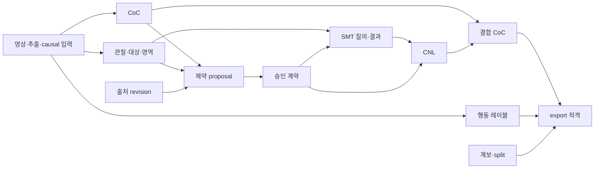

# GuardSynth Studio 설계 명세 v0.1

- project_id: `guardsynth-coc`
- subproject_id: `guardsynth-studio`
- 상태: 사용자 승인됨; 로컬 구현·검증 완료, 실제 VLM provider 수용은 미실행.
- 구현 결과: [구현 검증 보고서](../reports/GUARDSYNTH_STUDIO_IMPLEMENTATION_VERIFICATION_REPORT_V01.md).
- 승인 원문: “설계 명세 대로 구축을 진행해...”. 승인일: 2026-09-29, 정확 시각 미기록.
- 승인자: 현재 사용자 대화; 실명·계정 식별자 미기록.
- 범위 이력: 아래의 설계 단계 코드/DB/run 생성 금지는 작성 당시 범위다. 위 승인으로 Studio 구현·로컬 검증이 허용되었으며 실제 provider 선택·전송 승인은 별도다.
- 기준: [승인된 요구사항](../requirements/GUARDSYNTH_STUDIO_REQUIREMENTS_V01.md)
- 검증: [설계 검증 보고서](../reports/GUARDSYNTH_STUDIO_DESIGN_VERIFICATION_REPORT_V01.md)
- 범위: 웹도구 설계와 문서 기반 검증. 기존 연구 계획·학습·실험·검토 DB·논문 gate를 변경하지 않는다.

## D1. 아키텍처와 기본 결정

아래는 신규 구현에 적용할 설계이며 현재 존재하는 Studio 기능 목록이 아니다. 로컬의 소규모
인증 사용자 검토를 가정한다. 다중 서버·분산 큐·실시간 공동 편집은 도입하지 않는다.

| 구성 | 기본 선택과 경계 |
|---|---|
| 웹 UI/API | 동일 origin의 단일 웹앱, loopback 바인딩, 브라우저 기본 DOM 사용; 프레임워크는 구현 시 선택 |
| 영속 저장 | Studio 전용 SQLite, foreign key·WAL·명시적 트랜잭션·동기 commit; 기존 포털 DB 공유 금지 |
| 파일 | 서버 발급 opaque ID로 제한 artifact root의 원본·프레임·모델 원출력·export 참조; 사용자 경로를 받지 않음 |
| 작업 | SQLite 영속 큐와 작업자 1개; decode/VLM/SMT/export는 웹 요청 밖의 제한된 작업으로 수행 |
| 검증 | Project 04가 관찰·출처·적용성과 질의를 구성; EBLC 플랫폼이 구문·타입·Core·SMT·공용 CNL 담당 |
| VLM | 배포 시 단일 provider와 모델을 명시 설정; 미설정이면 생성 기능 비활성, mock 자동 대체 금지 |
| 실행 소유 | `artifacts/projects/guardsynth-coc/restricted/guardsynth-studio-001/<run-id>/`; 완료 export는 불변 |

웹앱 예정 위치는 `apps/guardsynth_studio/`다. 실제 코드 작성 전에 applications registry에
`guardsynth-coc` 소유를 등록한다. 프로젝트 장면 연결 로직은 Project 04, 범용 플랫폼 개선은
`platforms/eblc-bcv/` 소유다. 이번 단계는 문서만 생성하며 앱 등록·코드·DB·run은 만들지 않는다.

## D2. 화면과 인과적 프레임 탐색

상단에는 영상 이름, 추출 설정, 현재 실제 시각 t0, 저장 상태, 완료/전체 시점 수를 둔다.
왼쪽 시점 목록에는 모든 추출 시점과 미작성/초안/완료/오류 표시 및 오류 이동을 제공한다.
중앙에는 최대 7개 시간순 프레임과 확대 보기, 대상 점·영역 폴리곤 편집기를 둔다.
오른쪽에는 CoC, 행동 레이블, 제약/출처, 검사/CNL/결합 CoC 순의 패널을 둔다.
기본 화면에는 한글 의미·근거·미확인 상태를, 접힌 고급 패널에는 JSON/Core/질의/해시를 표시한다.
사용자는 각 승인과 시점 완료를 명시적으로 실행한다. 자동저장은 승인이나 완료가 아니다.

추출 manifest의 프레임을 `f[0..N-1]`, 현재 선택을 i라 할 때 t0는 `f[i].timestamp_us`,
표시 집합은 `f[max(0,i-6)..i]`다. 다음은 i+1, 이전은 i-1이며 끝에서는 버튼을 비활성화한다.
7개가 찬 뒤 다음은 왼쪽 하나 제거/오른쪽 하나 추가, 이전은 반대다. 초반에는 1개씩 늘거나 줄며
복제·padding하지 않는다. 프레임 클릭은 그 프레임을 t0로 선택한다. 확대만으로 t0는 바뀌지 않는다.
10개 프레임의 i=6 → 7 → 6은 1–7 → 2–8 → 1–7이다. N=0은 추출 실패/빈 영상으로 분리한다.

설계 기본 추출 간격은 1초이며 사용자가 변경할 수 있다. 원본 PTS와 time base를 보존하고,
각 간격 경계 이하의 마지막 표시 가능 프레임을 선택하여 중복 프레임을 제거한다. 첫·마지막
표시 가능 프레임도 포함한다. 누락/중복 PTS는 순서를 검증하고 모호하면 임의 FPS 보간 없이
추출 실패로 보고한다. 재추출은 새 manifest이고 기존 시점·승인을 덮어쓰지 않는다.

모델 입력 기본값은 현재 스트립의 최대 7개 프레임이다. 실제 입력 프레임·PTS·변환 해시를
별도 manifest로 저장한다. 표시 한도와 독립된 입력 정책은 향후 변경할 수 있으나 현재 배포는
이 기본값을 고정하고 입력 정책 버전을 기록한다. 모든 추출 시점은 탐색·생성 대상이며
전체 영상 자동 생성은 하지 않는다. 명시 선택 구간 작업도 시점별 독립 요청으로 분해한다.

## D3. 데이터 계약과 revision 저장

모든 신규 payload는 `studio_schema_version=1`을 가진다. ID는 서버 발급 문자열, 시각은
정수 microsecond와 원본 rational PTS, revision은 증가 정수다. JSON 스키마와 SQLite DDL은
후속 구현 산출물이며 아래가 필수 필드·제약의 설계 계약이다. 시간·사용자 ID는 서버가 기록한다.

| 엔터티 | 필수 필드 및 제약 |
|---|---|
| Video | video_id, original_sha256, asset_id, drive_id 또는 미확정, source/license/permission, classification=RESTRICTED, lineage_group_id, parent_video/원본 구간, lineage_status |
| Extraction | extraction_id, video_id, 설정/decoder 버전/해시, frame manifest, 상태; 성공 manifest 불변 |
| Frame | frame_id, extraction_id, ordinal, pts/time_base/timestamp_us, pixel_sha256, dimensions, asset_id; manifest 내 ordinal 유일 |
| Moment | moment_id, extraction_id, frame_id, t0_us, head_revision; `(extraction_id, frame_id)` 유일 |
| Revision | moment_id, revision, parent_revision, schema_version, component_refs, actor_id, server_time, payload_hash; 내용 불변 |
| Component | component_id, kind, content_hash, dependency_refs, payload; kind=CoC/binding/proposal/contract/check/CNL/combined/action/applicability |
| Source | source_id, revision, kind=EXTERNAL/POLICY/UNVERIFIED_MODEL, 문서/조항 위치·인용, 원문 해시·버전, 관할/유효 범위 또는 미확인, 검토 기록 |
| Approval | approval_id, moment_id, component_id/hash, dependency_digest, decision=APPROVE/REJECT/HOLD, actor_id, server_time, role/exposure, optional_note; 추가 기록만 허용 |
| Job | job_id, kind, moment_id 또는 export_id, input_refs/digest, provider_mode, 상태, attempt, lease/generation, idempotency_key, result/error refs |
| Export | export_id, 목적/mode, schema/profile/tool 버전, snapshot_refs/digest, lineage/split revision, 포함/제외 수·사유, output hashes, 상태 |

CoC payload는 `raw_output_ref`, `observations`, `relations`, `assumptions`, `unknowns`,
`action_rationale`, `suggested_actions`, `edited_text`, `input_manifest_ref`, 모델/프롬프트
버전을 갖는다. raw 원출력은 수정하지 않는다. 원본 CoC·승인 CoC·CNL·결합 CoC는 별도 component다.
모델이 준 구조가 잘못되면 INVALID_OUTPUT으로 보관하고 승인 가능한 초안으로 자동 변환하지 않는다.

Action payload는 `vocabulary_version`, 행동별 `APPROPRIATE/INAPPROPRIATE/UNKNOWN/NOT_APPLICABLE`,
근거·unknown mask·작성자 노출 정보와 독립 approval을 갖는다. 복수 APPROPRIATE를 허용한다.
NOT_APPLICABLE에는 메모를 강제하지 않는다. 기본 어휘는 진입/진입 보류이며 추가 관찰용
행동(속도 유지·정지 유지 등)은 저장 가능하지만 계약 대응은 UNSUPPORTED다. 도움말은
“주행 중 속도 유지”와 “이미 정지한 상태 유지”를 구분하고 보류를 정지/급제동으로 번역하지 않는다.
별도 승인은 데이터 구조의 독립성이지 평가 정답의 독립성 인증이 아니다.

서버는 `If-Match: revision`과 전체 dependency digest가 일치할 때만 revision을 추가하고
head를 갱신한다. 불일치는 409와 최신 head를 반환하며 자동 병합하지 않는다. 사용자는 자신의
미저장안과 최신안을 비교한다. 이미 승인된 내용의 수정은 새 초안이며 과거 승인 기록을 보존한다.

입력 변경은 500ms debounce 후 자동저장하되 시점 이동·완료·export 전에 즉시 flush한다.
UI는 저장 중/저장됨/실패를 구분한다. 저장 응답은 해당 moment와 mutation ID에만 적용한다.
브라우저 재로딩 중 미확인 수정은 로컬 IndexedDB outbox에 moment/base revision과 함께 보존하고,
재접속·재인증 후 재전송한다. 승인·비밀정보는 outbox에 넣지 않는다. 저장 불가 환경에서는 편집
전에 복구 불가 상태를 알리고 이동/닫기 전 명시 처리한다. 서버 확인 없는 수정은 완료로 세지 않는다.
서버 재시작 후 committed revision을 복원하고 outbox 중복은 같은 idempotency key로 제거한다.

대상/영역 payload는 읽을 수 있는 이름, frame_id, 정규화 픽셀 좌표, entity/zone ID, 검토 상태를
갖는다. 점/폴리곤 삭제는 현재 revision에서 좌표를 완전히 제거한다(빈 도형을 남기지 않음).
이전 승인 snapshot의 좌표는 감사 이력에 남고 학습 입력으로 재사용하지 않는다. 물리적 이력
파기는 별도 운영 정책이며 화면의 도형 삭제와 구분한다. 좌표는 거리·궤적·운전자 의도가 아니다.

## D4. API와 작업 실행 계약

모든 API는 `/api/studio/v1` 아래에 둔다. JSON 오류는 `code/message/field_errors/retryable`
형식이며 생성·변경 요청은 인증, CSRF, `Idempotency-Key`가 필요하다. 같은 key/같은 body는
기존 결과를 돌려주고 같은 key/다른 body는 409다. 검증된 ID 외 파일 경로는 받지 않는다.

| 요청 | 입력 / 응답과 실패 조건 |
|---|---|
| GET `/capabilities` | 활성 provider_mode, 지원 profile/어휘, 자원 한도, schema 버전; 비밀정보 제외 |
| POST `/videos` | multipart 파일+출처/권한/계보; 201 video_id 또는 413 한도/422 손상·미지원; 외부 전송 아님 |
| POST `/videos/{id}/extractions` | 간격·decoder 정책; 202 extraction/job ID; 기존 extraction 불변 |
| GET `/extractions/{id}/moments?cursor=...` | 순서·PTS·상태 목록, 페이지 cursor; 모든 시점 접근 가능 |
| GET `/moments/{id}` | head revision, component/approval refs, causal strip; ETag |
| PATCH `/moments/{id}` | If-Match, 허용 component 편집, dependency refs; 200 새 revision/409; 승인 상태 직접 쓰기 금지 |
| POST `/moments/{id}/jobs` | type=COC/PROPOSAL/CHECK/CNL, input_refs/digest, If-Match; 202 또는 409/422/503 provider 미설정 |
| GET `/jobs/{id}` / POST `/jobs/{id}/cancel` | 상태/결과 ref; 취소는 현재 lease 무효화, 이미 종료면 현재 상태 반환 |
| POST `/approvals` | stage, moment/component/hash/dependency digest, decision; 201, 409 stale, 422 전제 미충족 |
| POST `/approvals/batch` | 시점별 refs+사용자가 확인한 diff digest; 원자적 전부 승인 또는 409, 조용한 부분 승인 금지 |
| POST `/moments/{id}/complete` | If-Match와 승인/검사 refs; 적격 상태 계산 후 200 또는 이유가 있는 422 |
| POST `/exports` | scope, snapshot 예상 refs, purpose/mode/split revision; 트랜잭션으로 202 export/job ID |
| GET `/exports/{id}` / GET `/assets/{id}` | 인증·owner 확인 후 상태 또는 허용 파일 bytes; 임의 경로 읽기 금지 |

GET은 상태를 바꾸지 않는다. COC는 프레임만, PROPOSAL은 승인 CoC·프레임·선택 출처만,
CHECK는 승인 계약·바인딩만, CNL은 같은 버전의 승인·통과 검사를 입력으로 받는다.
모델 응답을 적용할 때도 head와 입력 digest를 재검사한다. 응답 자체는 별도 원출력으로 남기되
편집된 최신안에 자동 병합하지 않고 STALE_RESULT로 표시한다.

Job 상태는 QUEUED → RUNNING → SUCCEEDED/FAILED/TIMED_OUT/CANCELLED/STALE_RESULT다.
취소나 lease 교체 후 이전 generation의 완료는 head에 적용하지 않는다. 재시작 시 RUNNING은
INTERRUPTED로 회수한다. 순수 decode/check는 명시 재시도 가능하고, provider 요청 전송 여부가
불명확하면 OUTCOME_UNKNOWN으로 두어 사용자 재시도 전 중복 비용 가능성을 알린다.
429/quota/auth 실패는 기록 후 중단하며 계정·모델 자동 전환을 하지 않는다.

## D5. VLM과 인과성 경계

provider adapter 계약은 `generate(task, ordered_frames, prompt, schema, limits)` →
`raw_output, parsed_candidate, provider_request_id, model_version, usage, finish_reason`이다.
실제 호출을 지원하는 provider는 배포 전 선택·권한·라이선스·입력 수용량을 확인한다. provider의
hidden conversation을 이어 쓰지 않고 각 시점을 독립 호출한다. mock은 `provider_mode=MOCK`이며
UI·job·export에 전파하고 실제 연동 수용 시험 및 학습 적격 자료에서 제외한다.

서버가 frame refs를 해석하여 `timestamp_us <= t0`와 동일 extraction을 검사한다. 사용자가
보낸 임의 이미지·전체 동영상·미래 프레임 ref를 provider에 전달하지 않는다. cache key에는
영상/추출/시점, 모든 입력·dependency 해시, prompt/provider/model 버전이 포함된다.
이전 CoC 재사용은 기본 꺼짐이며 켤 때도 t<=t0와 재사용 chain의 최대 관찰시각을 재검사한다.
장면 요약·caption·대상 연결·관찰 근거 역시 max_observed_timestamp를 가진다. 미래 방문 뒤
과거로 돌아가도 세션 이력과 미래 결과를 넣지 않는다. 미래 정보가 섞인 원본 CoC는 보존하되
누출 표식을 달고 승인 수정본 또는 해당 표본 제외로 처리한다. 사람이 본 미래 정보의 영향을
자동 판별할 수 없으므로 검토 노출 이력과 causal-only 확인을 남긴다.

출처 텍스트·영상·CoC는 인용 데이터다. 도구 실행·URL fetch·파일 접근 지시로 해석하지 않는다.
외부 provider 전송은 영상 권한과 별도 전송 승인을 확인한 causal frame 묶음만 허용하며 승인
범위/전송 대상/입력 해시를 기록한다. provider 설정이나 모델 변경은 기존 job을 재해석하지 않는다.

## D6. 제약·출처·승인과 상태 전파

proposal은 기존 bundle 스키마를 검증한 뒤 Studio envelope에 저장한다. envelope는 제안 ID,
CoC/출처/binding revision, 지원 profile, activation/release/time scope, 가정/미확인, 승인 refs를
추가한다. 기존 `PROPOSED/REVIEW_REQUIRED/UNSUPPORTED/CONFLICT/NOT_APPLICABLE` verdict는
사람 승인과 다르다. CoC의 epistemic_kind=CLAIMED를 사실/법규 인증으로 승격하지 않는다.

출처 패널은 source_claim_refs/source_record_refs와 실제 문서 버전·조항 위치·본문을 대조한다.
규칙의 관할·효력·시점 적용성이 미확인이면 외부 법규 확정으로 승인할 수 없다. 연구 정책은
정책으로 승인할 수 있지만 법규가 되지 않는다. 미검증 모델 제안은 출처 보완 전 초안이다.
사용자가 대상/영역과 관찰 근거를 확인하여 BOUND로 기록한다. null 대상은 문맥 전체에 관한
의무라는 명시적 역할과 승인 근거가 있을 때만 허용하고, 식별 실패를 그 역할로 바꾸지 않는다.
영역은 진입 계약에 필수다. 임의로 국가·대기시간·거리·관찰되지 않은 TRUE/FALSE를 채우지 않는다.

시점 적용성은 별도 `UNREVIEWED/APPLICABLE/NOT_APPLICABLE/UNRESOLVED`로 관리한다.
NOT_APPLICABLE은 후보 목록과 근거를 본 사용자의 명시 승인만 가능하다. 빈 목록·거절·미지원·
UNKNOWN은 UNRESOLVED다. 현재 위험이 FALSE여도 적용 가능한 진입 규칙 자체가 없어지는 것은 아니다.

승인 순서는 CoC → 출처/대상/영역 binding → 제약/계약 → 검사 → CNL/결합 CoC다.
행동 레이블은 별도 승인하며 계약의 allowed actions를 복사하지 않는다. 기본 UI에서 레이블
초안을 제약 패널보다 먼저 작성할 수 있고, 제약을 열었는지와 모델 제안 노출도 기록한다.
결합 CoC와 기존 행동이 충돌하면 둘을 표시하고 재검토하며 솔버가 행동 레이블을 고치지 않는다.

변경은 다음 그래프의 실제 dependency_refs를 따라 전파한다. 상태 STALE은 보존된 승인
기록의 현재 적격성을 나타내며 과거 approval을 삭제하지 않는다.

행동 근거가 CoC/binding/제약을 실제 참조했다면 그 참조도 의존 간선이다. 그렇지 않으면
제약 수정만으로 독립 레이블 내용을 stale로 만들지 않되, 새 결합본과의 일치 확인은 다시 한다.
renderer 변경은 CNL 이후, query/compiler 변경은 검사 이후만 무효화한다. 추출 변경은 새
moment 집합을 만들며 승인 이전 금지다. 앞 시점 상태를 선택적으로 참조하면 뒤 시점만
전파하고 뒤 시점 관찰을 앞 시점 입력에 역전파하지 않는다.

## D7. EBLC 프로파일·질의·CNL

Studio 기본 profile은 `studio-entry-v0.1`, 기반은 `eblc-action-contract-v0.1`이다.
subject=ego, horizon=3(추상 단계), 최대 16개 의무, policy=CLEAR_REQUIRED_FOR_ENTRY,
claim_scope=CONDITIONAL_ACTION_SELECTION_NOT_VEHICLE_SAFETY를 사용한다. 초기 UI의 한글
장면 어휘는 `pedestrian_conflict`와 `main_road_yield_required` 두 술어로 제한한다. 다른 술어·
행동·초 단위 해제는 UNSUPPORTED 초안이다. 플랫폼이 2–32 horizon을 파싱하는 능력과
Studio의 승인된 지원 프로파일은 별개다. 고급 수정도 지원 프로파일을 벗어나면 export하지 않는다.

승인 제약을 정해진 필드 매핑으로 action contract에 옮기고 `parse_action_contract` →
`lower_action_contract` → 승인 binding의 INITIAL 가정과 질의 추가 → `parse_core_model` →
`compile_core_model` → `check_queries` 순으로 진행한다. 모델이 Core 코드나 질의를 직접 실행하지
않는다. source_refs에는 고정된 출처·검토 refs를 포함하고 각 obligation의 rule_ref 포함관계를 검증한다.

각 의무의 `truth`는 TRUE/FALSE/UNKNOWN/CONFLICT이고 evidence_valid는 별도 boolean이다.
유효 TRUE면 활성, 유효 FALSE면 해제, 그 외 이전 활성 상태 유지다. 모든 의무가 현재 유효 FALSE일
때만 진입 허용; 하나라도 미확인/충돌/무효면 review_required이며 진입 보류다. 처음 prior_active는
관찰됨/미확인을 구분한다. 미확인이면 SMT에서는 자유 변수로 남기고 가능한 양 상태를 검사한다.
offset 0만 현재 관찰이고 1/2는 가상 후속 판단이다. 미래 witness는 UI의 관찰·CoC에 입력하지 않는다.

질의의 기대값은 고정된 profile 논리와 승인 입력으로 정하며 실제 solver 결과에 맞춰 바꾸지 않는다.

| 질의 묶음 | 구성과 기대값 |
|---|---|
| Q1 현재 전제 | 관찰 binding을 포함한 base `true`: SAT; UNSAT면 뒤 금지 질의도 통과로 세지 않음 |
| Q2 현재 행동 | ENTER: 모든 의무 clear면 SAT, 아니면 UNSAT; DEFER: SAT; 관찰 가정의 부정: UNSAT |
| Q3 불확실성 | review_required 기대값의 부정: UNSAT; 미관찰 prior 각각 TRUE/FALSE 전제의 도달 가능성: SAT |
| Q4 해제/금지 | offset 1의 전체 clear 전제 SAT; clear+ENTER 및 clear+DEFER SAT; not-all-clear+ENTER UNSAT |
| Q5 생명주기 경계 | 별도 가상 입력 harness에서 offset 0 활성 → 1 해제 → 2 재활성, 각 전제 SAT·반대 active/금지 ENTER UNSAT; UNKNOWN/CONFLICT/무효일 때 유지도 검사 |

Q5는 실제 offset 0 관찰을 강제로 바꾸는 검사가 아니라 동일 계약의 별도 가상 시나리오다.
한 의무 해제만으로 나머지가 해제되지 않음을 포함한다. 초 단위 전/동일/후 비교는 이 profile에
없으므로 시간 임계 제안은 미지원으로 검증한다. `AT-06` 경계는 현재 profile에서는 추상
전이 전·동일·후를 뜻하고 향후 시간 profile에는 별도 단위/근거/경계 질의가 필요하다.

검사 적격은 필수 Q1–Q5의 비어 있지 않은 목록, 기대값 일치, 현재 input digest 일치를 모두
요구한다. UNKNOWN/timeout/error/cancel/미실행은 통과가 아니다. 기존 check_queries는 자체
timeout을 설정하지 않으므로 제한된 하위 프로세스를 외부 작업자가 종료하고 TIMED_OUT을 기록한다.
질의·Core·SMT2·기대/실제·solver/compiler 버전을 보존한다. SAT는 주어진 가정의 충족 가능성이고
영상/법규의 진실·안전·독립 정답이 아니다.

공용 `render_action_contract`의 결정적 영어 CNL과 mapping_record는 구조 투영으로 재사용한다.
renderer 자체가 SMT를 호출하지 않으므로 서비스가 같은 contract/check digest를 확인한다.
한글은 위 두 술어에 한정된 Studio 템플릿을 설계하며 검토 귀속 관찰, 현재 허용 행동,
조건부 재판단을 명확히 나눈다. 각각 source/binding path, Core clause, support query ID와
renderer/language version을 저장한다. `scene_conditioned_cnl`의 문구·질의 패턴은 참고하되
일반 업로드 바인딩 및 모든 필수 질의가 이미 구현되었다고 간주하지 않는다.

동일 입력+renderer/language version의 텍스트/hash는 동일해야 한다. 한글 템플릿 구현과
조항 대응 검증 전에는 한글 CNL 적격을 표시하지 않는다. 수동 편집/번역은 `DERIVED_TEXT`로
원문과 분리하고 의미 검토 승인을 다시 받는다. 구조 명세를 자동 역파싱하지 않는다. 파생문은
검토 기록과 함께 보관하되 결정적 검증 CNL export에는 사용하지 않고, 필요하면 계약을 수정하여
재검사·재생성한다. 결합 CoC는 승인 CoC 뒤 별도 제약 블록을 붙이는 결정적 합성으로 원문을 보존한다.

## D8. export와 시점 완료

시점 완료는 `ENHANCED_READY`, `BASELINE_ONLY_READY`, `REVIEW_COMPLETE_HELD`로 나눈다.
완료 수와 학습 적격 수를 별도 표시한다. HELD는 사용자가 미지원/미확인 사유를 확인한 검토 완료이며
학습 적격이 아니다. 모든 상태는 저장된 현재 refs에 대해 서버가 계산하고 오류 목록으로 연결한다.

| 경로 | 적격 조건 |
|---|---|
| 제약 강화 | 실제 provider CoC, 승인 CoC/binding/source/계약, 필수 검사 PASS, 결정적 CNL 및 결합 승인, 별도 행동 승인, 충돌 없음, 전체 refs 현재, causal/권한/계보 확인 |
| baseline만 | 실제 provider CoC 및 행동 승인, 사람이 승인한 NOT_APPLICABLE, causal/권한/계보 확인; 강화 수에 포함하지 않음 |
| 초안 | 나머지 전부; MOCK·STALE·UNSUPPORTED·UNKNOWN·노출/누출 상태·제외 사유를 보존, 학습 적격 표시 금지 |

관찰 UNKNOWN인 계약은 보류 정책 검사가 PASS일 수 있으나 review_required가 남아 있으므로
현재 학습 강화 적격은 HELD다. 부재를 FALSE로 만들어 통과시키지 않는다. 독립 평가용 목적은
독립 검토자·제약 노출 분리 근거가 없으면 거부하며, 기본 목적은 DEVELOPMENT_TRAINING이다.

export 트랜잭션은 선택된 moment heads, component/approval/check refs, split/lineage revision을
고정한다. 오래된 예상 head는 409다. job은 고정 snapshot만 읽으며 이후 UI 수정과 섞지 않는다.
출력 생성 뒤 공개 전 권한 철회·출처 무효화·계보 변경 여부를 재검사하여 취소하거나 새 snapshot을
요구한다. 단순 후속 편집은 과거 기준시각의 snapshot을 변조하지 않으며 그 시각/버전을 표시한다.
부분 파일은 다운로드하지 못하고 manifest·행 수·해시 검증 뒤 READY로 원자적 게시한다.

JSONL은 `sample_id, pair_id, snapshot_ref, inputs, targets, provenance`로 분리한다.
provenance에는 영상/주행/원본 계보, t0, 실제 frame refs/PTS/변환 해시, 라이선스, 원본/승인 CoC,
proposal/contract/Core/check/CNL/결합 refs, 행동 근거·mask, 모든 버전/승인 및 split을 포함한다.
학습 소비자는 allowlist된 inputs/targets만 읽으며 provenance를 prompt에 펼치지 않는다.

| mode | inputs | targets |
|---|---|---|
| ACTION_WITH_CONTEXT | 공통 causal frames·질문 + baseline 승인 CoC 또는 강화 결합 CoC | 별도 승인 행동과 unknown mask |
| COC_TARGET | 공통 causal frames·질문만 | baseline 승인 CoC 또는 강화 결합 CoC + 별도 승인 행동/mask |

ACTION_WITH_CONTEXT는 CoC의 행동 결론·레이블 유출이 없는 context projection을 사람이
확인한 경우만 적격이다. 의미를 유지하며 분리할 수 없으면 COC_TARGET 또는 초안으로 돌린다.
CoC에서 행동을 자동 추출해 정답으로 만들지 않는다. 두 모드 모두 정답 필드·근거·mask는 inputs에
없고, mode/profile 버전을 고정한다. baseline/강화 pair는 동일 영상·시점·질문·행동 승인 refs와
split을 가지며 의도된 CoC/CNL 차이만 허용한다. 독립 정답이라는 추가 주장은 하지 않는다.

split은 개별 프레임이 아닌 원본 lineage/주행 그룹 단위다. 같은 해시 재업로드, 재추출,
겹치는 파생 클립, 동일 주행은 하나의 연결 그룹에 묶고 train/validation/test 단일 값을 강제한다.
해시가 다른 재인코딩은 부모 원본/구간 증빙을 요구하며 해시만으로 독립성을 추정하지 않는다.
계보 불명은 split 보류다. 그룹 병합 시 상충 split이면 export 차단; 이미 게시된 export는
수정하지 않고 별도 철회 기록과 후속 export에서 제외한다. 신규 export는 기존 run을 덮어쓰지 않는다.

## D9. 보안·자원·복구

읽기와 쓰기 모두 인증된 owner 범위로 제한한다. 쓰기는 CSRF·Host/Origin 검증을 추가한다.
포털의 scrypt/session/route 검증 패턴은 참고하되 독립 auth 설정을 사용한다. HttpOnly·SameSite
쿠키, CSP, textContent로 렌더링하고 모델/사용자 HTML은 실행하지 않는다. 인증 세션은 재시작 시
재로그인하지만 저장 revision은 유지한다. 자격증명은 서버 비밀 저장소에만 두고 브라우저 저장소,
원출력 메타데이터, 로그, export에는 넣지 않는다. 로컬 outbox는 민감 문서 캐시로 안내하며
로그아웃 시 미전송 수정 처리 후 제거한다.

asset ID는 DB에서 허용 root의 실제 파일로 해석한다. 업로드 filename·symlink·다중 decode
경로 이탈·절대 경로를 신뢰하지 않는다. 허용 컨테이너/codec probe와 byte·dimension·duration
검사를 decode 전에 수행하고 decoder는 shell interpolation 없이 네트워크 비활성 제한 프로세스로
실행한다. MVP 컨테이너는 MP4, codec은 H.264를 기본으로 하되 실제 decoder 버전/지원은 배포 검증한다.
외부 출처 URL은 식별 메타데이터이며 자동 fetch하지 않는다.

다음 수치는 성능 실측이 아닌 보수적인 설계 기본값이다. 시작 시 검증·UI 공개하며 변경은
설정 버전으로 남긴다. provider 한도가 더 작으면 더 작은 한도를 적용한다.

| 대상 | 기본 상한 / 실패 처리 |
|---|---|
| 업로드 | 파일 1 GiB, 30분, 최대 3840×2160, 120초 요청; 초과 413, 손상/미지원 422 |
| 추출 | 최대 10,000 프레임, 300초, decoder 메모리 2 GiB; 실패 시 부분 manifest 미게시 |
| VLM | 요청 7프레임, 프레임 긴 변 1280px 이하 변환 기록, 입력 텍스트 32 KiB, 출력 16 KiB, 120초; 초과 실패 |
| 큐 | 활성 작업자 1, 대기 100, 구간 요청 100시점; 한도 초과 429, 중복 key는 추가하지 않음 |
| SMT | horizon 3, 의무 16 이하, 검사 job 30초/1 GiB; 외부 종료는 TIMED_OUT |
| 저장/export | 편집 payload 1 MiB, export 10,000시점·300초, 쓰기 전 2 GiB 여유공간 확보; 디스크 부족 시 미완료 표시 |

비용이 발생하는 모델 재시도는 사용자 실행당 최대 1회 수동 재시도, 자동 재시도 0회다.
auth/quota 실패에는 설정 변경 지시 없이 명확한 사유를 표시한다. 취소는 결과 채택을 막지만
provider 비용 취소를 보장하지 않는다. 파일 저장은 임시 쓰기→해시 확인→원자 이동 후 DB ref commit,
재시작은 DB가 가리키는 검증 완료 파일만 사용한다. 영속 DB와 파일의 함께 복원 가능한 백업 정책은
배포 시 확정한다. 본 문서의 자원 한도로 기존 학습 GPU를 점유할 권한은 부여되지 않는다.

## D10. 재사용 근거와 남은 결정

| 근거 코드 | 확인한 사실 / 추가로 필요한 Studio 작업 |
|---|---|
| [포털 저장](../../../../apps/research_portal/review_store.py) | 검토 회차·할당·불변 revision; Studio moment/outbox/job/export schema는 신규 |
| [포털 보안](../../../../apps/research_portal/security.py) | scrypt·loopback·session/CSRF·경로/CSP 도우미; Studio upload/provider 경계는 신규 |
| [proposal schema](../../src/guard_synth/schemas/constraint_proposal_bundle.schema.json) | verdict와 출처/binding 참조, CLAIMED; 사람 승인 envelope는 신규 |
| [action contract](../../../../platforms/eblc-bcv/src/guard_synth_eblc/action_contract.py) 및 [schema](../../../../platforms/eblc-bcv/src/guard_synth_eblc/schemas/eblc_action_contract.schema.json) | 제한된 행동·2–32 horizon·1–16 의무, 기본 consistency만; 관찰 바인딩·Q1–Q5 필요 |
| [SMT](../../../../platforms/eblc-bcv/src/guard_synth_eblc/smt_compiler.py) | check_queries의 SAT/UNSAT/UNKNOWN·SMT2·witness; timeout은 작업자 경계에서 추가 |
| [공용 CNL](../../../../platforms/eblc-bcv/src/guard_synth_eblc/cnl_renderer.py) | 영어 결정적 단방향 구조 투영, source/hash mapping; 출처/SMT gate는 별도 |
| [장면 CNL](../../src/guard_synth/scene_conditioned_cnl.py) | 두 술어·단일 관찰·한영 템플릿, learning_export_allowed=False; 일반 업로드 학습 승인 아님 |
| [scene18](../../src/guard_synth/qualitative_scene_contract.py) 및 [검토 연결](../../src/guard_synth/reviewed_action_contract.py) | 고정 clip/시점/대상 검증; 범용 extractor로 연결 금지 |

배포 전 미결정은 실제 provider/model·라이선스·전송 승인·자원/비용 예산, decoder 환경,
백업/보존 정책과 위 자원 기본값의 실측 적합성이다. 구현 단계에서 확인할 항목은
한글 템플릿/질의 conformance, 일반 영상의 사람 검토 binding UI, DB transaction/outbox 복구다.
이들은 문서 설계 검증이나 요구사항 승인만으로 완료되지 않는다. 새로운 조사·논문 gate는 추가하지 않는다.
