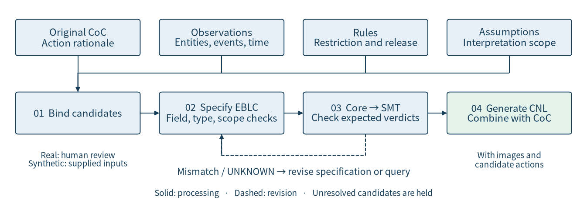
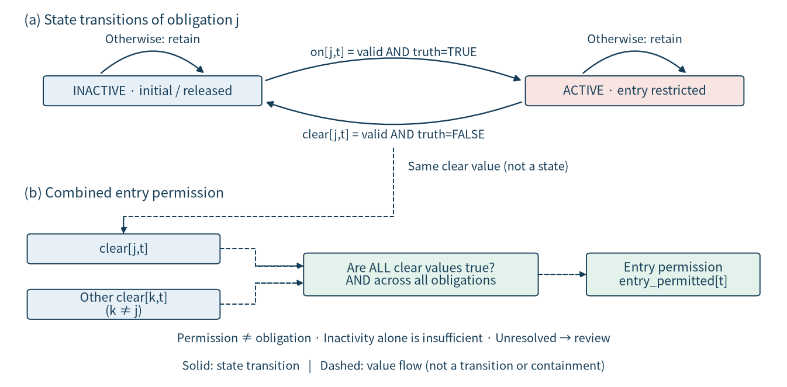
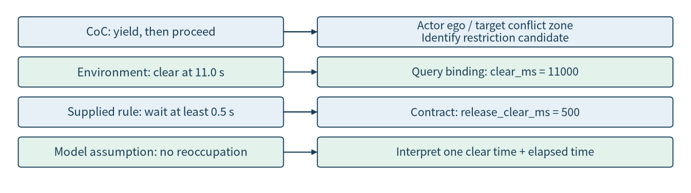
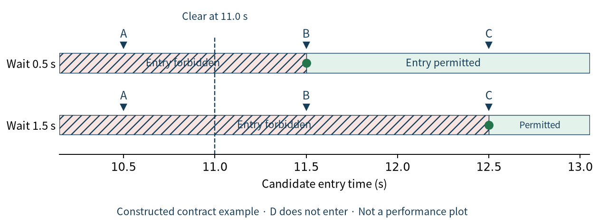
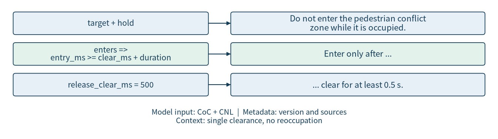

# IV. Proposed Method

This section presents the GuardSynth workflow and defines the elements and semantics of EBLC. It then explains how constraints are derived from CoC, observations, and rules, checked logically, and rendered as CNL for insertion into CoC. Executable examples connect each task to its constraint fields, logical formula, generated text, and evaluation verdict.

## A. Overview and Inputs and Outputs

GuardSynth preserves the action explanation in CoC while making conditions that restrict action selection explicit in a separate specification, then returning those conditions to a natural-language representation. Inputs comprise original CoC, scene observations available for the decision, and applicable rules with their evidence. Outputs comprise structured behavioral constraints, logical verification results under a restricted model, controlled natural language (CNL) generated from the specification, and an augmented learning input. The formal representation specifies condition semantics and verification scope; the language representation conveys those conditions to learning.

The process first selects candidate constraints and checks their evidence, then specifies accepted constraints in EBLC. Structural and semantic checks precede conversion to a verification-oriented intermediate representation and SMT queries. CNL corresponding to the specification is subsequently generated and combined with original CoC.



Figure 1. The upper row distinguishes four input roles; stages 01–04 below run from evidence binding to CoC augmentation. Solid arrows show processing order; the dashed path returns unexpected verdicts or UNKNOWN for revision. Unresolved candidates are held at stage 01. Real scenes require human confirmation of applicability evidence; synthetic experiments bind supplied conditions.

The inputs in Figure 1 provide non-interchangeable information. Original CoC supplies action and rationale context for identifying relevant constraint candidates. The other three inputs are defined below as observational values, behavioral rules, and interpretation scope.

**Observations: definition and example.** An observation describes the state of an entity, zone, or event at a specified time. Real-scene observations are linked to evidence such as video and its confirmation, whereas the primary synthetic experiment uses states supplied by the generating environment. “The conflict zone became clear at 11.0 seconds” is an event-time observation. Stage 01 in Figure 1 binds the entity and event; stage 03 binds clear_ms = 11000 as an environmental query variable. This observation alone does not determine a required waiting duration.

**Rules: definition and example.** A rule specifies which action is restricted under an applicability condition and when that restriction is released. “Do not enter for at least 0.5 seconds after clearance” is a supplied experimental rule. Stage 01 in Figure 1 confirms its applicability evidence; stage 02 specifies the restricted action and release_clear_ms = 500. The duration is neither an observed scene property nor a value inferred from CoC.

**Modeling assumptions: definition and example.** A modeling assumption states the scope within which inputs are interpreted and verified. “The zone is not reoccupied after clearance” allows continuous clearance to be represented by one clearance time. Stage 02 in Figure 1 records this assumption as contract scope; stage 03 uses it in the logical interpretation. If reoccupation is possible, the assumption must be reconsidered before applying the same single-time expression.

Consequently, the same observation at 11.0 seconds yields admissibility from 11.5 or 12.5 seconds under supplied waits of 0.5 or 1.5 seconds. Stage 04 in Figure 1 conveys the specified and verified restriction through CNL. Separating these roles prevents treating an observation as a rule or an assumption as an observed fact.

Executable numerical and qualitative profiles instantiate this approach. The learning experiments use a temporal profile and static/maneuver candidate-summary profiles constructed from supplied synthetic rules. A separate qualitative profile connects entities, zones, and events through observations and human review of real scenes. Both link specifications to evidence, but their inputs and semantics differ. We use the temporal contract as the running example and the qualitative profile to describe evidence uncertainty and constraint lifecycles. Implementation evidence is linked in [S1](../experiments/paper1_cnl_learning/temporal_preservation.py) and [S2](../../../platforms/eblc-bcv/src/guard_synth_eblc/action_contract.py).

## B. Formal Specification with EBLC

### 1. Scope and Elements

A behavioral constraint restricts available actions in a situation. It differs from an observation, an action rationale, and an objective that ranks admissible actions. Satisfying an entry-permission condition does not force entry; selecting among permitted actions requires a separate objective.

Evidence-Bound Lifecycle Contracts (EBLC) represent constraints with their targets, conditions, action restrictions, persistence and release, and evidence. Evidence-Bound denotes explicit links to the inputs on which conditions and rules depend. Lifecycle denotes activation, persistence, release, and, where required, reactivation. This paper uses these organizing principles and implemented restricted profiles, rather than assuming a language covering every traffic situation.

| Element | Specification role | Temporal instantiation |
|---|---|---|
| Subject and target | Whose action is restricted, and with respect to what? | Ego and pedestrian conflict zone |
| Scope | Situation and model of interpretation | Single clearance transition without reoccupation |
| Action restriction | What is disallowed? | Entry before release conditions hold |
| Persistence and release | When does the restriction persist or end? | Required duration following clearance |
| Time and units | Instants, durations, and boundaries | Integer milliseconds; inclusive threshold |
| Evidence and version | Rule sources and interpretation | Rule references and profile version |

The qualitative profile additionally represents event truth, evidence validity, initial activation, and a policy for combining obligations. These elements address uncertain scene evidence; they are not all evaluated in the primary temporal learning experiment. The proposed modeling scope and experimentally evaluated scope are distinguished.

### 2. Contract Definition and Interpretation

We use $C = (s, z, \Sigma, O, E, V)$ to explain the profile organization: $s$ denotes the actor, $z$ the target or zone, $\Sigma$ the scope and modeling assumptions, $O$ the set of restrictive obligations, $E$ the observation and rule evidence links, and $V$ the interpretation version. This is explanatory notation, not a new six-field JSON schema. Actual serialization follows the restricted profile in Code Box 1.

An obligation is interpreted through its activation condition, persistence and release rules, restricted action, and any required initial state. The temporal profile compresses these into a single clearance time and a waiting duration. The qualitative profile updates activation from evidence and the previous state at each decision step. Assumptions and state variables from different profiles are not interchangeable.

Let $h_t$ denote the supplied evidence and state history through decision step $t$, and $a$ a current action candidate. The meaning of a contract is its admissible candidate set $A_C(h_t)$. Membership means compatibility with the stated conditions and restrictions. Subscript $t$ identifies the decision step, and $C$ identifies the contract. Multiple obligations combine their admissible sets by intersection, requiring all applicable restrictions to hold. The qualitative profile also imposes an entry policy requiring current clearance evidence. Previous inactivity is therefore distinct from current entry permission.

An independent objective selects among admissible candidates. Deferral and entry after sufficient waiting may both be permitted while receiving different progress scores. Separating admissibility from optimization prevents interpreting compliance as optimality.

### 3. Temporal Syntax and Semantics

The temporal profile accepts a structured JSON contract. The following is actual generator output for a 0.5-second waiting rule. Source references provide traceability and contain no target action label.

**Code Box 1. Actual generated temporal contract JSON**

The input is a supplied 0.5-second waiting rule; the output is a contract containing its target, release condition, and assumptions. Line numbers refer to positions within this box.

```json
{
  "version": "supplied-temporal-eblc-profile-v0.1",
  "subject": "ego",
  "target": "pedestrian_conflict_zone",
  "hold": "NO_ENTRY_WHILE_OCCUPIED",
  "release_clear_ms": 500,
  "time_unit": "ms",
  "source_kind": "SUPPLIED_SYNTHETIC_RULE",
  "assumption": "SINGLE_CLEAR_TRANSITION_NO_REOCCUPATION",
  "source_refs": [
    "Project01/temporal_guard_world.py::_guard",
    "paper1-method-preservation-v0.1"
  ]
}
```

The `subject` and `target` identify the actor and restricted zone. The `hold` field specifies no entry during occupancy; `release_clear_ms` specifies waiting after clearance. The `assumption` field specifies one occupied-to-clear transition without subsequent reoccupation. This permits continuous clearance to be represented by one clearance time and an elapsed duration.

In Code Box 1, lines 2–5 fix the version and restriction target; lines 6–7 specify duration and units. Lines 8–9 identify the supplied synthetic rule and no-reoccupation assumption, while lines 10–13 preserve source references. Environmental clearance and candidate entry times are bound separately rather than mixed into this rule JSON.

Evaluation separately binds environmental clearance time `clear_ms`, candidate entry time `entry_ms`, and Boolean entry indicator `enters`. Both times use integer milliseconds. The restriction is:

`enters → entry_ms ≥ clear_ms + release_clear_ms`

For `clear_ms = 11000` and `release_clear_ms = 500`, an entering candidate is compatible only at or after 11500ms. The inclusive comparison admits 11500ms but excludes 11499ms. A non-entering candidate has `enters = false` and does not violate this entry restriction; its progress is assessed separately.

The validator checks the supported version and fixed field combinations. Supported durations are 500, 1500, 800, and 1800ms; the primary expanded learning dataset uses 500 and 1500ms. The implementation accepts a restricted profile with defined interpretation, not arbitrary JSON as a general contract. [S1](../experiments/paper1_cnl_learning/temporal_preservation.py), [S3](../experiments/paper1_cnl_learning/temporal_training_data.py)

Writing $\tau=\mathit{clear\_ms}$, $\Delta=\mathit{release\_clear\_ms}$, $u=\mathit{entry\_ms}$, and $e=\mathit{enters}$ gives $P_C(e,u,\tau)=\neg e\lor(u\geq\tau+\Delta)$. Candidates satisfying $P_C$ belong to the temporal admissible set. Both $\tau$ and $u$ are instants, whereas $\Delta$ is a duration. This distinguishes a zone being clear from having remained clear for the required duration.

### 4. Qualitative Lifecycle Semantics

The real-scene profile uses `truth[j,t]`, `valid[j,t]`, and `active[j,t]` for obligation j at decision step t. Truth values are TRUE, FALSE, UNKNOWN, and CONFLICT. FALSE denotes confirmed resolution of the restricting condition, not mere absence of an observation. Validity denotes admissibility of the evidence. Activation records whether the obligation is active; its value before the first decision is a separate input.

**Code Box 2. Pseudocode for evidence-based state updates**

Inputs are the current truth value and evidence validity for obligation j, together with previous activation; the output is current activation. This is explanatory pseudocode, not a verbatim source excerpt.

```text
on[j,t] = valid[j,t] AND (truth[j,t] = TRUE)
clear[j,t] = valid[j,t] AND (truth[j,t] = FALSE)
active[j,t] = TRUE,             if on[j,t]
              FALSE,           else if clear[j,t]
              previous_active, otherwise
```

Evidence is read and activation updated before constraining the action. Valid activation evidence activates an obligation, valid clearance evidence releases it, and otherwise its previous state persists. The same rule reactivates it when the activation condition is confirmed again. Explicit ordering and initialization fix the interpretation at each step.

The current policy permits entry only when clearance of every declared obligation is confirmed. Previous inactivity alone does not permit entry if current clearance is unconfirmed. When all obligations are clear, both entry and deferral are allowed. Permission is not a liveness guarantee requiring progress. UNKNOWN and CONFLICT are evidence states, distinct from an SMT solver returning UNKNOWN when it cannot decide a query. [S2](../../../platforms/eblc-bcv/src/guard_synth_eblc/action_contract.py)

Lines 1–2 of Code Box 2 require both validity and the corresponding truth value. Lines 3–5 select activation, release, or persistence. At the first step, `previous_active` is the explicit `prior_active` input; subsequently it is activation at the preceding step. A single truth value cannot be both TRUE and FALSE, so activation and clearance cannot simultaneously hold in this encoding.



Figure 2. (a) shows the state transitions of an individual obligation j; (b) combines all obligations' clearance conditions to determine entry permission. Solid arrows denote transitions or state retention; dashed arrows carry current clear values. The release condition in (a) and its corresponding input in (b) use the same evidence-derived value, combined with other obligations' clear values by AND. Panel (b) is neither a third state nor a nested state of (a). Because inactivity includes both initial inactivity and release, permission depends on current clearance of every obligation, not inactivity alone.

The policy is `entry_permitted[t] = AND_j clear[j,t]`; ENTER_ZONE requires this value to be true. DEFER_ENTRY does not violate this entry restriction. Unknown, conflicting, or invalid evidence separately sets `review_required`. For example, starting from inactivity, valid evidence TRUE → UNKNOWN → FALSE → TRUE yields active → active → inactive → active. Entry is permitted only at the third decision, where deferral remains possible. This is a constructed semantic illustration.

### 5. Why Use an EBLC Profile?

JSON specifies a serialization structure; by itself it does not assign lifecycle semantics, define the interpretation of unknown evidence, or establish what a generated sentence means. General temporal logics can express many of these conditions, and hand-written rules can implement them. EBLC is not claimed to be more expressive than those alternatives. Its role here is to fix a domain-specific contract between evidence fields, interpretation rules, supported Core lowering, and model-facing language. For example, `release_clear_ms` denotes a duration rather than an event time, a `ge` bound is inclusive, and `source_refs` records provenance rather than a model answer.

The contribution is thus an explicit development interface with checkable mappings, not the invention of implication, JSON, or SMT. Each implemented profile has a validator, logical interpretation, and renderer; unsupported combinations are rejected. The experiments evaluate the utility and checks of this path, not superiority over an equally specified JSON-to-SMT system. A bare schema would become an equivalent engineering alternative only after supplying the corresponding semantics, lowering, provenance policy, and language mapping.

## C. Defining and Deriving Behavioral Constraints

### 1. Separating Candidate Constraints from Evidence

Not every CoC sentence becomes a constraint. “A pedestrian is crossing” is an observational claim; “yield to protect the pedestrian” is an action rationale. “Do not enter while the zone is occupied” contains a condition and restriction, making it a constraint candidate. “Choose the admissible candidate with greatest progress” is a selection objective. This distinction avoids inventing thresholds or release conditions absent from the explanation and its evidence.

Inputs serve three evidence roles. CoC identifies potentially relevant actions and obligations. Scene observations bind entities, zones, events, and times. Supplied rules or separately established normative evidence determine applicability and restriction content. A sentence appearing in CoC does not itself confirm applicability to the current scene.

### 2. Specification Procedure and Automation Scope

The procedure identifies action-relevant entities, situations, and rationales in CoC, then binds entities and zones to observations and identifies the decision time. Rule evidence determines the restricted action and applicability conditions; persistence, release, timing, and assumptions are subsequently specified. Unconfirmed information remains unresolved rather than becoming an observed fact. Accepted content is mapped to supported fields with evidence references and version information.

In the primary synthetic experiment, the environment generator and supplied rule provide these inputs. Environmental clearance and rule duration determine the contract and verification representation. Automation structures and transforms given conditions; it does not discover traffic law or waiting durations from video alone. The real-scene path involves human confirmation of entities, zones, events, and applicability, and the implemented adapter is limited to a particular review task. [S3](../experiments/paper1_cnl_learning/temporal_training_data.py), [S4](../src/guard_synth/qualitative_scene_contract.py)

Constraints and learning references are managed separately. Defining admissibility does not automatically establish a real-scene ground-truth action. For the synthetic task, separate integer arithmetic uses known environmental states and rules to identify admissible candidates, then selects the one with greatest progress. This calculation does not copy its answer from CNL or an SMT verdict, but shares the environmental and rule assumptions.



Figure 3. Environmental clearance at 11.0 seconds binds a query variable, whereas the supplied 0.5-second duration becomes a contract field. No reoccupation is an assumption needed to connect these values through a temporal inequality. Derivation distinguishes these roles when constructing evidence-supported fields.

### 3. Running Temporal Example

Original CoC reads “Yield to the crossing pedestrian, then proceed through the intersection.” The environment supplies clearance at 11.0 seconds; a separate rule requires a minimum wait of 0.5 or 1.5 seconds. The duration is an explicit experimental condition, not a value inferred from CoC or a universal traffic-law requirement.

| Candidate | Entry time | Progress score | 0.5-second wait | 1.5-second wait |
|---|---|---|---|---|
| A | 10.5s | 110 | Violates | Violates |
| B | 11.5s | 100 | Admissible; reference | Violates |
| C | 12.5s | 85 | Admissible | Admissible; reference |
| D | No entry | 0 | Admissible | Admissible |

Progress is a synthetic utility, not measured distance or speed. B maximizes admissible progress under the 0.5-second contract and C under the 1.5-second contract. D violates neither but does not complete the progress objective. The table is a generated data instance, not evidence of actual model predictions. Candidate labels rotate during dataset construction to avoid linking the answer to a fixed letter.

### 3. What Is Extracted, From Where, and Where It Is Placed

Constraint extraction here means selecting and binding action-relevant content to a supported specification, not converting every sentence into a rule. The following source allocation prevents a model or annotator from inventing a normative threshold from an image.

| Source | Selected content | Destination |
|---|---|---|
| Original CoC | Intended action, rationale, potential obligation | Constraint kind and relevance candidate; preserve the original CoC separately |
| Scene evidence or synthetic state | Target, zone, decision time, clearance event, candidate measurements | Entity bindings and query assignments; not rule thresholds |
| Supplied rule or reviewed rule evidence | Restricted action, applicability, comparison, bound, release requirement | EBLC obligation or `limits` fields with source references |
| Explicit modeling decision | Time scope, no reoccupation, completion convention | Versioned profile assumptions, disclosed with evaluation scope |

In the numerical experiments, bounds are read from supplied rule fields (`threshold`, `max_decel`, `max_jerk`, `min_gap`, or the temporal wait) rather than inferred from pixels. The static and maneuver compiler stores each bound as `field/op/unit/ticks` under `limits`; `scale=1000` expresses integer milli-units after checking the external unit. Candidate measurements are bound only when a candidate is queried. Real-scene development instead requires reviewer-confirmed observations and applicability before specification; extraction accuracy is not established by the synthetic learning scores.

The output sentence is appended to the existing rationale in the model-facing `Requirement CoC` text, before candidate descriptions and the selection instruction. The actual static data use `rich_coc_text = COC_TEXT + " " + CNL`; maneuver data append `constraint_text` to the CoC requirement. The separate record retains EBLC, provenance, verification results, and the reference label. Neither the reference label nor SAT/UNSAT is inserted as a hint. This defines both the content to extract and its precise destination.

## D. Verifying EBLC Specifications Linked to CoC

### 1. Binding Checks and Core Lowering

Verification requires semantic input binding and logical queries. Subject, zone, event time, and duration must refer to the same case, and specifications must satisfy supported version, field, and unit requirements. Evidence identifiers support traceability rather than proving factual truth. Unbound fields are distinguished from completed scene bindings; passing syntax checks does not turn a conditional specification into reviewed learning data.

Temporal contracts lower to Core declarations of Boolean `enters` and integer `clear_ms` and `entry_ms`; `release_clear_ms` becomes an integer constant. Core is an intermediate representation of declarations and logical clauses, type-checked before SMT compilation. Time uses integer millisecond ticks with Core unit marker `1`, not seconds. Variables in this profile are time-invariant and the clause is enforced initially. The configured `horizon = 2` is a model bound, not verification of a two-second driving trajectory. [S1](../experiments/paper1_cnl_learning/temporal_preservation.py)

### 2. Properties and Queries



Figure 4. The horizontal axis is entry time in seconds. The same clearance event yields admissibility from 11.5 or 12.5 seconds depending on the duration. Closed boundary points include the threshold instant. D is a non-entry candidate, not a point on this axis. The graph computes contract semantics rather than model accuracy or measured driving performance.

We distinguish consistency, restriction enforcement, release boundaries, and permissibility. Base SAT establishes a satisfying model, but non-entry alone can satisfy the specification. We therefore separately check that an entering model exists after release. This avoids specifications that exclude all entry without substituting for measurement of actual model progress.

| Property | Query | Expected | Interpretation |
|---|---|---|---|
| Consistency | Base contract | SAT | A satisfying case exists |
| Restriction | Entry earlier than release | UNSAT | Early entry and contract are incompatible |
| Before boundary | Entry at 11.499s; wait 0.5s | UNSAT | Entry just before release is excluded |
| At boundary | Entry at 11.500s; wait 0.5s | SAT | Equality is permitted |
| After boundary | Entry at 11.501s; wait 0.5s | SAT | Entry after release is feasible |
| Deferral | enters is false | SAT | Entry is not forced |

Concrete times assume clearance at 11.0 seconds. The restriction query searches for a counterexample with `enters` true and `entry_ms < clear_ms + release_clear_ms`. This is symbolic rather than fixing both time variables; boundary rows bind concrete values. Even the symbolic result concerns the encoded inequality and assumptions, not video interpretation or rule selection.

The six manuscript queries were executed for both 500ms and 1500ms contracts, yielding 12 matching verdicts. The existing bridge's 100 queries were rerun separately. Neither set constitutes new learning-effect evidence. Records preserve each query, expected and observed verdicts, and actual SMT-LIB output. [S5](../../../artifacts/projects/guardsynth-coc/public/paper1-method-preservation-001/methodology-2026-09-30-001/manuscript_examples.json)

### 3. SMT Representation and Interpretation

The following readable SMT-LIB example expresses the core 0.5-second restriction. It is an explanatory representation, not the entire compiler output, which is retained in separate query files.

**Code Box 3. Executable SMT-LIB example comparing early and boundary entry**

Inputs are the contract duration and clearance at 11000ms. Each candidate time is fixed in turn to query compatibility with the contract.

```text
(declare-const enters Bool)
(declare-const entry_ms Int)
(declare-const clear_ms Int)
(assert (= clear_ms 11000))
(assert (=> enters (>= entry_ms (+ clear_ms 500))))
(assert enters)
(push)
(assert (= entry_ms 11499))
(check-sat) ; unsat
(pop)
(push)
(assert (= entry_ms 11500))
(check-sat) ; sat
(pop)
```

The first UNSAT verdict indicates incompatibility of early entry with the specification, not a defective specification. The second SAT verdict indicates compatibility of the selected entry. Neither includes optimality or real-world safety. UNKNOWN or unexpected verdicts are not accepted as successful verification. Structural checks, scene binding, logical verification, and CNL correspondence serve different roles.

Lines 1–3 of Code Box 3 declare types; line 4 binds environmental clearance and line 5 states the restriction. Line 6 excludes satisfying the query through non-entry. Lines 7–10 temporarily add 11499ms, obtain UNSAT, and remove that candidate condition. Lines 11–14 add 11500ms to the same base contract and obtain SAT. The push/pop scopes prevent both candidate conditions from remaining simultaneously and causing an artificial contradiction.

## E. CNL Generation and CoC Augmentation

### 1. Generating Sentences from Verified Specifications

CNL is generated from checked fields through fixed sentence rules. The temporal renderer accepts structurally validated contracts and maps zone and duration to text. It does not itself invoke the solver; specification verification precedes rendering. Candidate labels, reference actions, and progress scores are not generator arguments. [S1](../experiments/paper1_cnl_learning/temporal_preservation.py)

**Code Box 4. Verbatim excerpt of the CNL generator**

The following is the actual render function in S1. Input raw is a temporal contract; the return value contains two sentences. Numbers count logical source lines; long lines wrap within the box.

```python
def render(raw):
    validate(raw)
    # Render only validated contract fields, never scene target/candidate/answer.
    return ('Do not enter the pedestrian conflict zone while it is occupied. '
            f'Enter only after the zone has remained clear for at least {raw["release_clear_ms"]/1000:.1f} s.')
```

Line 2 requires an exact match to a supported contract. Since validation also fixes the target and restriction type, line 4 can emit a constant zone phrase. Line 5 converts milliseconds to seconds with one decimal place, exactly representing the currently supported durations. The function neither invokes the solver nor selects a target action. Other targets or arbitrary precision would require a separate extension.

Actual output for the 0.5-second contract is:

> Do not enter the pedestrian conflict zone while it is occupied. Enter only after the zone has remained clear for at least 0.5 s.

The first sentence identifies the zone and occupancy restriction; the second expresses release and duration. “At least” corresponds to an inclusive boundary, and “only after” specifies a necessary condition rather than an instruction to enter. The conversion maps 500ms to 0.5s and, under the same rule, 1500ms to 1.5s. Correspondence is interpreted for supported durations and the single-clearance, no-reoccupation assumption.



Figure 5. Target and restriction map to the first sentence; release duration and the inclusive boundary map to the second. Original CoC and CNL enter the model together, while source and version metadata remain separately traceable. Colors distinguish mappings, not additional levels of verification.

### 2. Scope of Semantic Correspondence

Generation preserves target, negation, conditional direction, value, and unit. Omitting “at least” or replacing “enter only after” with a requirement to enter after clearance would change admissibility. Fixed field mappings make these relationships explicit and inspectable.

Not all metadata appears in model-facing sentences. Versions and source references remain traceability metadata; CNL conveys action-relevant conditions. Modeling assumptions are specified in the environment and task definition. The claim is correspondence of action restrictions within that context, not literal one-to-one rendering of every JSON field. Freely rewritten sentences or additional profiles require separate semantic review.

### 3. Combining CNL with Learning Inputs

Original CoC provides an action rationale, and CNL supplies additional behavioral conditions. They are combined without replacing CoC with a specification. In the comparison below, the resulting text is **original CoC + added CNL**; the right column shows only the added component. Temporal rows reproduce synthetic training text, whereas the STOP row summarizes and translates the core of a real-scene development output.

| Example | Original CoC | Added CNL |
|---|---|---|
| Pedestrian yielding, 0.5-second rule | Yield to the crossing pedestrian, then proceed through the intersection. | Do not enter the pedestrian conflict zone while it is occupied. Enter only after the zone has remained clear for at least 0.5 s. |
| Pedestrian yielding, 1.5-second rule | Yield to the crossing pedestrian, then proceed through the intersection. | Do not enter the pedestrian conflict zone while it is occupied. Enter only after the zone has remained clear for at least 1.5 s. |
| Worker's STOP sign, development example | Stop at the stop sign held by the construction worker for the one-way alternating traffic zone ahead. | While the confirmed stop instruction applies to ego at the current decision, do not start or accelerate even if motion state is unknown. This does not prohibit deceleration intended to stop or continued waiting; instruction clearance is not established. |

The first two rows pair different waiting rules for the same task, not different scene categories. If the zone clears at 6.0 s, entry at 6.5 s meets the 0.5-second condition but not the 1.5-second condition. CNL thus distinguishes prohibition and release conditions absent from the shared CoC; the durations are supplied experimental rules. The STOP row expresses a prohibition common to moving and stationary states and is separate from the main synthetic performance experiment. Constraint augmentation also does not automatically establish the factual accuracy of the original CoC: in development scene #68, the original red-light claim remained unconfirmed, while the constraint was grounded in a separately confirmed worker's STOP instruction.

The image and action candidates accompany this text, while a separate reference calculation supplies the target label. P0 receives original CoC, P1 receives CoC with the existing natural-language constraint, and P2 receives CoC with EBLC-derived CNL. P1 and P2 both add constraints; their primary comparator is CoC-only P0. Raw EBLC JSON and solver verdicts are not supplied as answer hints.

P1 and P2 receive constraints during both training and evaluation. This evaluates selection using explicit rules, not directly whether identical behavior persists without evaluation-time constraints. P0 lacks the waiting duration, so its inputs can be identical for paired contracts requiring different reference actions. This information difference is disclosed as part of the comparison.

Traceable records retain image references, CoC, contracts and evidence, CNL, candidates, reference actions, and splits, separating model-visible fields from answers and verification fields. This supports reconstruction of what was specified from which evidence, how it was expressed, and which action served as the learning target. Training budgets and metrics are presented in the experimental section.

## F. From Task to Constraint Fields, Formula, CNL, and Verdict

Table M1 links the six evaluated tasks to actual supported contract fields and logical clauses. The examples are drawn from frozen test contracts: static scene 20000, stopping scene 20000, and lane-change scene 20001; the temporal row uses the running boundary query. They illustrate the implementation, not six independently collected road videos.

Let $q$ denote `completes`, $e$ denote `enters`, and $\widehat{x}$ denote a candidate measurement scaled by 1000. Each non-temporal Core clause is $q\Rightarrow(\widehat{x}\ \mathrm{op}\ b)$, where $b$ is the stored integer `ticks`. For stopping, three clauses are conjoined. Static candidates all complete; noncompletion in a maneuver is nonviolating but does not count as goal completion. The generated CNL conveys numeric bounds but does not separately render the Core exemption for noncompletion. Correspondence of bounds for goal-completing candidates is therefore distinguished from whole-contract equivalence over noncompleting behavior; the latter is not established here. The profile checks stored candidate summaries, not continuous trajectories.

**Table M1. Executed task-to-verdict mappings; CNL cells quote generated clauses**

| Task | Constraint fields | Actual logical condition | Generated CNL | Candidate judgment |
|---|---|---|---|---|
| Maximum speed | `speed/le/m/s/4400` | $q\Rightarrow\widehat{v}\leq4400$ | The candidate's maximum speed must be at most 4.4 m/s. | A: 6.0 m/s, UNSAT; B: 2.8 m/s, SAT |
| Minimum clearance | `clearance/ge/m/2000` | $q\Rightarrow\widehat{d}\geq2000$ | The candidate's minimum obstacle clearance must be at least 2 m. | A: 0.9 m, UNSAT; B: 3.1 m, SAT |
| Minimum entry delay | `entry_delay/ge/s/2500` | $q\Rightarrow\widehat{u}\geq2500$ | The candidate's intersection entry time from now must be at least 2.5 s. | A: 0.9 s, UNSAT; B: 4.1 s, SAT |
| Temporal clearance | `release_clear_ms=500`; `clear_ms=11000` | $e\Rightarrow u_{\mathrm{ms}}\geq11000+500$ | Enter only after the zone has remained clear for at least 0.5 s. | 11499 ms: UNSAT; 11500 ms: SAT |
| Stopping | `stop_offset_m`, `peak_decel`, `peak_jerk`; bounds 0, 5800, 7400 | $q\Rightarrow(\widehat{o}\leq0\land\widehat{a}\leq5800\land\widehat{j}\leq7400)$ | Stop at or before the stop line (stop offset at most 0 m). | C beyond line: UNSAT; D within all bounds: SAT and preferred |
| Lane change | `min_gap_m/ge/m/5800` | $q\Rightarrow\widehat{g}\geq5800$ | The candidate's minimum gap during the lane change must be at least 5.8 m. | D: UNSAT; A: SAT and preferred; C: SAT but incomplete |

For stopping, the two remaining generated clauses are “The candidate's peak deceleration must be at most 5.8 m/s^2.” and “The candidate's peak jerk must be at most 7.4 m/s^3.” Thus the table abbreviates the CNL display, not the checked contract. Here $o$ is signed stop offset, $a$ peak deceleration, $j$ peak jerk, $g$ minimum lane-change gap, $v$ maximum speed, $d$ minimum obstacle clearance, and $u$ entry delay. Temporal clearance differs from a fixed delay from now: it binds an observed clearance instant before adding the required wait.

For a selected candidate $a$, the solver checks $\Phi_C\land B(a)$, where $\Phi_C$ is the compiled contract and $B(a)$ fixes its measurements and completion flag. SAT means compatible with this contract; UNSAT means incompatible. Independently implemented task rules compute admissibility and choose the admissible candidate with greatest progress. Agreement with that choice defines accuracy; selecting an inadmissible candidate defines a violation. Consequently, a SAT candidate can still be an accuracy error because it makes less progress or fails to complete. The two implementations share supplied task assumptions, so their agreement checks implementation correspondence rather than independent road safety.

The experimental section follows the same order: task-wise accuracy and violations, response to changed contracts, and specification/CNL quality. Detailed per-candidate records and unsupported-error cases remain in the supplement.

## Implementation and Example Evidence

These links provide reproducibility evidence for manuscript review, separate from external related-work citations. They will connect to code and data availability and supplementary material in the integrated manuscript.

- [S1 Temporal contracts, Core lowering, verification, and CNL generation](../experiments/paper1_cnl_learning/temporal_preservation.py)
- [S2 Qualitative contract parsing and lifecycle semantics](../../../platforms/eblc-bcv/src/guard_synth_eblc/action_contract.py)
- [S3 Learning inputs and independent reference calculation](../experiments/paper1_cnl_learning/temporal_training_data.py)
- [S4 Restricted real-scene adapter](../src/guard_synth/qualitative_scene_contract.py)
- [Synthetic training records for the before-and-after comparison](../../../artifacts/projects/guardsynth-coc/public/paper1-method-preservation-001/temporal-training-data-2026-09-29-001/train_paired.jsonl)
- [Real-scene development records for the before-and-after comparison](../../../artifacts/projects/guardsynth-coc/restricted/guardsynth-eblc-learning-001/speed-development-packaging-2026-09-29-003/l3_admitted_train.jsonl)
- [S5 Executed manuscript queries and results](../../../artifacts/projects/guardsynth-coc/public/paper1-method-preservation-001/methodology-2026-09-30-001/manuscript_examples.json)
- [Two example learning-input records](../../../artifacts/projects/guardsynth-coc/public/paper1-method-preservation-001/methodology-2026-09-30-001/learning_input_examples.json)
